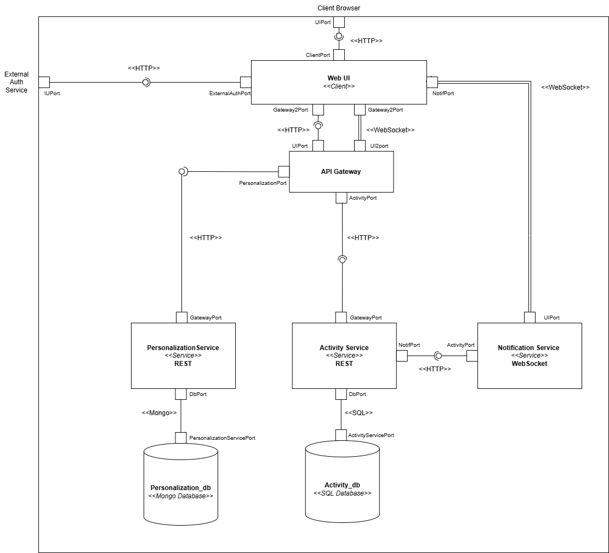

# 🧠 Planio — Prototype 1

## 👥 Team

**Name:** Group E  

**Members:**
- Jeronimo Bermudez Hernandez  
- Juan Sebastian Cabezas Mateus  
- Jenny Catherine Herrera Garzon  
- Sharick Yelixa Torres Monroy  
- Laura Sofia Vargas Rodriguez  

---

## 💻 Software System

### Name
**Planio**

### Logo

  

### Description
Planio is a social web application designed for families, friends, and small groups who want to organize their daily activities in one place.

It allows users to create shared rooms where members can:
- Manage tasks using a Kanban-style board (TODO / DONE)
- Track daily group habits
- View activity in real time  
- Earn rewards through a coin system  

Coins can be used to customize avatars and decorate shared virtual rooms, encouraging collaboration and engagement.

---

## 🏗️ Architectural Structures

### 🔹 Component and Connector (C&C) View

---

### 🔹 Architectural Styles

The system follows a **microservices architecture**, where the application is divided into small, independent, and specialized services.

Key characteristics:
- Independent deployment per service  
- Communication via HTTP REST and WebSocket  
- Decoupled data persistence per service  

It also incorporates principles from **Service-Oriented Architecture (SOA)**, enabling service reuse and loose coupling.

---

### 🔹 Architectural Elements and Relations

#### 🧩 Components

- **Web UI**  
  Client-side application running in the browser.  
  Communicates with the backend using HTTP and WebSocket.

- **API Gateway**  
  Single entry point to the backend.  
  Handles authentication (Google OAuth), JWT generation, and request routing.

- **Activity Service**  
  Core of the system. Manages:
  - Rooms  
  - Tasks  
  - Habits  
  - Coins  
  - Activity logs  

- **Personalization Service**  
  Manages:
  - Avatars  
  - Items  
  - Virtual rooms  

- **Notification Service**  
  Handles real-time updates using WebSocket.

- **Databases**
  - **PostgreSQL (Activity DB):** transactional data  
  - **MongoDB (Personalization DB):** flexible data  

---

#### 🔗 Connectors

- **HTTP REST**
  - Used for synchronous communication between services  

- **WebSocket**
  - Used for real-time communication (notifications)  

---

#### ⚙️ Key Architectural Decisions

- API Gateway as a single entry point  
- Database separation per service  
- Use of ACID transactions in the core service  
- WebSocket used only for notifications  
- Minimal and controlled coupling between services  

---

## 🚀 Prototype

### 🔧 Instructions to run locally

1. Clone the repository:
- git clone https://github.com/unal-sw-arch/swarch-2026i

2. Navigate to the repository:
- cd swarch-2026i

3. Switch to the project branch:
- git checkout prototype1_E_group_workbranch

4. Go to the project folder:
- cd ProyectoPlanio

5. Start the services with Docker:
- docker-compose up -d --build

6. Run the frontend:
- cd front
- npm install
- npm run dev

7. Open the application in your browser:
- http://localhost:5173/