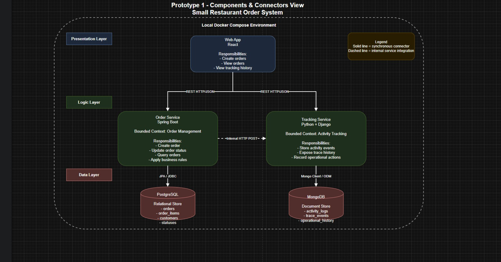

# DELIUNAL

Team B - Software Architecture 2026-I

## Team Members

- Manuel Alejandro Navas Bohorquez
- German Camilo Bernal Ladino
- Edwin Felipe Pinilla Peralta
- Juan David Rivera Buitrago
- Obed Felipe Espinosa Angarita

## System Overview

DELIUNAL is a delivery platform for two main user groups:

- Customers browse restaurants, select menu items, place orders, and follow order status.
- Restaurants manage menu availability and operational order flow.

The system is organized as a microservice-based architecture with separate presentation, application, and data components.

## Main Components

| Layer | Component | Technology | Responsibility |
| --- | --- | --- | --- |
| Presentation | Customer App | Next.js | Customer-facing ordering experience |
| Presentation | Restaurant Dashboard | React + Vite | Restaurant operations dashboard |
| Boundary | API Gateway | Node.js + Express + TypeScript | Public HTTP entry point, routing, security controls |
| Logic | Auth Service | FastAPI | Customer and restaurant authentication |
| Logic | Catalog Service | NestJS | Restaurants, menus, product availability |
| Logic | Order Service | Spring Boot | Order creation and order queries |
| Logic | Kitchen Service | Go | Kitchen queue and status transitions |
| Logic | Notification / Tracking Service | Django | Activity history and order timeline |
| Data | PostgreSQL | Docker | Auth, catalog, and order persistence |
| Data | MongoDB | Docker / Atlas | Tracking events |
| Infrastructure | RabbitMQ | Docker | Event broker |
| Infrastructure | Valkey | Docker | Shared cache |

## Architecture

The system combines layered architecture and service-based architecture. Public clients communicate with the API Gateway, and the Gateway forwards requests to internal services. Services own their data stores and communicate through HTTP and asynchronous events where required.



## Lab 4 - Security

Lab 4 implements the **Web Application Firewall (WAF)** security pattern in the API Gateway.

The WAF inspects incoming HTTP requests before they reach downstream services and blocks:

- SQL injection signatures.
- Cross-site scripting signatures.
- Path traversal attempts.
- Oversized requests.

Lab 4 deliverables:

- Technical guide: [docs/lab4-security/README.md](./docs/lab4-security/README.md)
- Classroom PDF: [docs/lab4-security/Lab_4_Security_DELIUNAL_WAF.pdf](./docs/lab4-security/Lab_4_Security_DELIUNAL_WAF.pdf)

## Running the Prototype

Requirements:

- Docker Desktop
- Node.js 18.18 or newer for local API Gateway checks

Run all services:

```powershell
docker compose up -d --build
```

Stop all services:

```powershell
docker compose down
```

Main local URLs:

| Component | URL |
| --- | --- |
| Customer App | http://localhost:3001 |
| Restaurant Dashboard | http://localhost:5173 |
| API Gateway | http://localhost:4000 |
| Catalog Service | http://localhost:3000 |
| Order Service | http://localhost:8080 |
| Notification / Tracking Service | http://localhost:8000 |
| Auth Service | http://localhost:8001 |
| RabbitMQ Management | http://localhost:15672 |

## Security Configuration

The API Gateway WAF is enabled through environment variables:

```env
WAF_ENABLED=true
WAF_MODE=block
WAF_MAX_BODY_BYTES=1048576
```

Modes:

- `block`: malicious requests are rejected with `403` or `413`.
- `detect`: malicious requests are logged but forwarded, useful for rule tuning.

Do not commit real secrets. Use `.env.example` as the template and keep local `.env` files private.

## Verification

API Gateway local checks:

```powershell
cd apps/api-gateway
npm ci
npm run test:waf
npm run build
```

Docker image smoke test:

```powershell
cd apps/api-gateway
docker build -t deliunal-api-gateway-waf-test .
```

WAF runtime examples:

```powershell
curl.exe -i http://localhost:4000/health
curl.exe -i "http://localhost:4000/health?search=%27%20OR%201%3D1%20--"
curl.exe --path-as-is -i "http://localhost:4000/%2e%2e/%2e%2e/etc/passwd"
```

Expected result:

- Clean `/health` request returns `200`.
- SQL injection request returns `403`.
- Path traversal request returns `403`.
