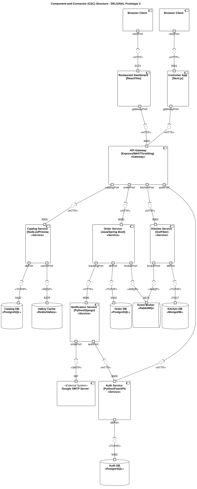
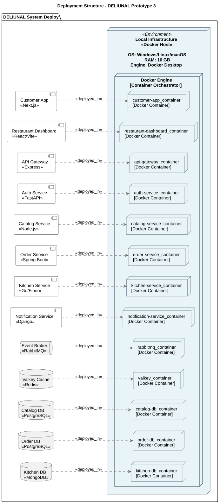
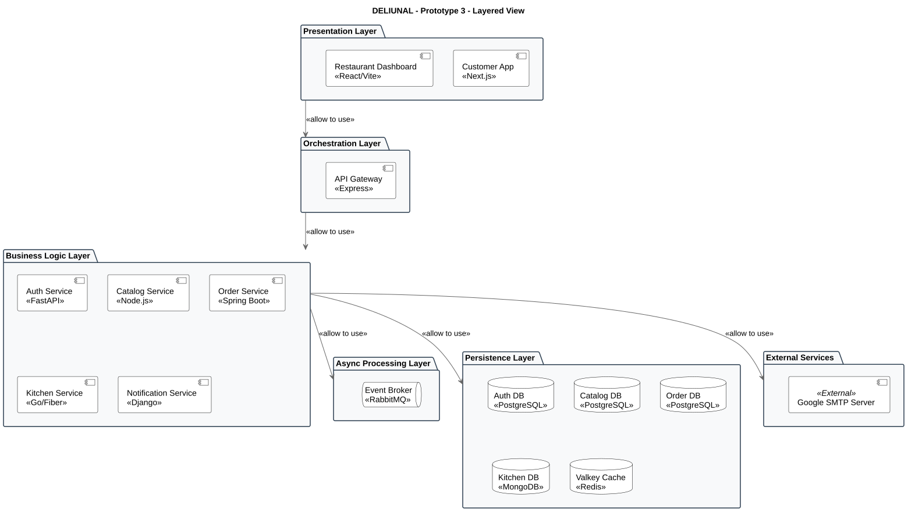
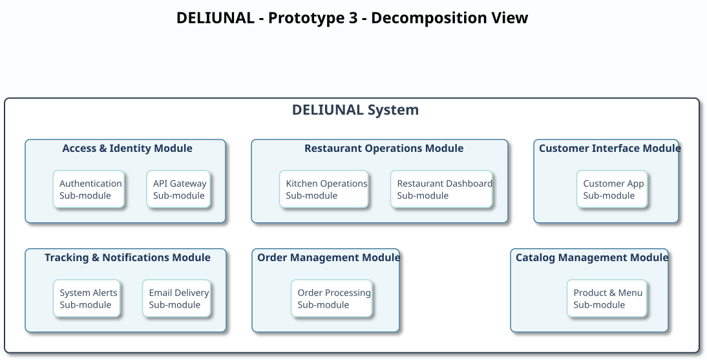

# Prototype 3 — Quality Attributes (Security, Performance & Reliability)

---

## Team

- **Name:** 3b (Team B)
- **Members:**
  - Manuel Alejandro Navas Bohorquez
  - German Camilo Bernal Ladino
  - Edwin Felipe Pinilla Peralta
  - Juan David Rivera Buitrago
  - Obed Felipe Espinosa Angarita

---

## Software System

- **Name:** DELIUNAL
- **Logo:**

  <p align="center">
    
  </p>

- **Description:** DELIUNAL is a comprehensive food delivery platform focused on optimizing the entire food ordering and order tracking ecosystem. The system is specifically designed for restaurants handling cash-on-delivery models, aiming to streamline logistics and perfectly synchronize preparation and delivery times with the customer. Our solution connects two main profiles:
  - **Restaurants and Kitchens:** Can digitally manage their businesses by publishing interactive menu catalogs, adjusting prices, controlling availability, and receiving orders in real time. Kitchens can view and manage the preparation flow of each dish, sending automatic status updates as soon as the food is ready for dispatch.
  - **Customers and Users:** Can explore a wide gastronomic offer, search for their favorite restaurants, customize their shopping carts, and quickly place orders for payment at home. Once the order is confirmed, users enjoy an advanced live tracking system, monitoring every stage of the process: from the moment the restaurant approves the order and cooking begins, to the exact moment it arrives in their hands.

  At an engineering level, the system is robustly built as a set of highly scalable **microservices**, deployed via Docker Compose and orchestratable in Kubernetes.

---

## Architectural Structures

### Component-and-Connector (C&C) Structure

**C&C View:**



**Main elements and relations:**

| Component | Technology | Responsibility |
|---|---|---|
| Customer App | Next.js (SSR) | Customer frontend: registration/login, exploring restaurants, cart, orders |
| Restaurant Dashboard | React + Vite | Restaurant operational frontend: menu/availability management |
| **API Gateway** | Node.js + Express | Single entry point; routing, authentication (JWT), role enforcement, caching |
| Auth Service | Python (FastAPI) | Registration, login, JWT issuance/validation |
| Catalog Service | Node.js + TypeScript | Restaurants, menus, items, availability |
| Order Service | Java (Spring Boot) | Order creation and lifecycle |
| Kitchen Service | Go | Kitchen order processing via events |
| Notification / Tracking Service | Python | Activity events and tracking history |
| Event Broker | RabbitMQ | Asynchronous messaging between services |
| Cache | Valkey (Redis-compatible) | Read caching at the gateway |
| Databases | PostgreSQL ×3, MongoDB | Polyglot persistence per service |

**Connectors:**

- **Synchronous REST HTTP/JSON** between frontends → API Gateway → services.
- **Asynchronous AMQP** (RabbitMQ) between Order / Catalog / Kitchen / Notification.
- **JDBC / Prisma / ODM** between each service and its database.

**Styles and patterns used:**
- **Microservices** with *bounded contexts* (DDD): Order Management, Catalog, Auth, Kitchen, Tracking.
- **API Gateway / Reverse Proxy** as the single entry point.
- **Event-Driven Architecture** via RabbitMQ.
- **Polyglot persistence** (PostgreSQL for transactional data, MongoDB for events/logs).

### Deployment Structure

**Deployment View:**



- **Local (Docker Compose):** segmented topology across three networks — `edge-net` (TLS edge + frontends + gateway), `backend-net` (gateway + microservices + broker + cache, `internal`), and `data-net` (microservices + databases, `internal`). A TLS terminator (`nginx-tls`) exposes HTTPS.
- **Kubernetes:** the `api-gateway` is deployed as a Deployment with 2 replicas, exposed by a NodePort Service, with readiness/liveness probes.

**Deployment patterns:** Containerization, Cluster Pattern (K8s), Active Redundancy (Hot Spare).

### Layered Structure

**Layered View:**



- **Presentation:** Customer App, Restaurant Dashboard.
- **Business Logic / Application:** API Gateway + business microservices.
- **Data:** PostgreSQL, MongoDB, Valkey, RabbitMQ.

### Decomposition Structure

**Decomposition View:**



Decomposition by *bounded context*: each microservice encapsulates its domain, API, and data store, communicating exclusively through REST contracts/events.

---

## Quality Attributes

> Each scenario is documented with **source · stimulus · artifact · environment · response · response measure** (ATAM format).

### 🔒 Security

#### Scenario S1 — Controlled Single Entry Point (Reverse Proxy) ✅

| Field | Value |
|---|---|
| **Source** | External client (browser / attacker) |
| **Stimulus** | HTTP request to any system capability |
| **Artifact** | API Gateway |
| **Environment** | Normal operation |
| **Response** | The gateway validates JWT and role, hides internal topology, and forwards only authorized requests to services; internal services are not directly exposed |
| **Measure** | 100% of external traffic passes through the gateway; 0 business services with externally published ports after segmentation |

- **Applied pattern:** **Reverse Proxy Pattern**.
- **Tactics:** *Authenticate users* (JWT in [auth.middleware.ts](./apps/api-gateway/src/middlewares/auth.middleware.ts)), *Authorize users* (roles in [role.middleware.ts](./apps/api-gateway/src/middlewares/role.middleware.ts)), *Limit exposure* (single entry point).

#### Scenario S2 — Internal Network Isolation (Network Segmentation) ✅

| Field | Value |
|---|---|
| **Source** | Attacker on the host network |
| **Stimulus** | Attempted direct connection to an internal database or service |
| **Artifact** | Docker Compose network topology |
| **Environment** | Normal operation |
| **Response** | Databases and business services reside in internal networks (`internal: true`) without published ports; only the TLS edge, frontends, and gateway are externally reachable |
| **Measure** | Only edge/frontend/gateway ports remain exposed; direct DB/service connections from the host = rejected |

- **Applied pattern:** **Network Segmentation Pattern**.
- **Tactics:** *Limit access*, *Restrict exposure*.
- **Implementation:** `docker-compose.yml` defines three networks: `edge-net` (TLS edge + frontends + gateway), `backend-net` (gateway + microservices + broker + cache, `internal`), and `data-net` (microservices + databases, `internal`). Published `ports:` were removed from DBs and internal services. Details in [infrastructure/edge/README.md](./infrastructure/edge/README.md).

#### Scenario S3 — End-to-End Secure Channel (Secure Channel / TLS) ✅

| Field | Value |
|---|---|
| **Source** | External client |
| **Stimulus** | Sending credentials / JWT over the network |
| **Artifact** | HTTPS edge (nginx) in front of the API Gateway |
| **Environment** | Normal operation |
| **Response** | Client↔edge traffic travels encrypted with TLS; HTTP (80) redirects to HTTPS (443) |
| **Measure** | 100% of edge traffic over TLS; credentials are never in plain text |

- **Applied pattern:** **Secure Channel Pattern**.
- **Tactics:** *Encrypt data in transit*.
- **Implementation:** `nginx-tls` service acts as TLS terminator ([infrastructure/edge/nginx.conf](./infrastructure/edge/nginx.conf)) with a self-signed certificate for the local environment ([generate-cert.ps1](./infrastructure/edge/generate-cert.ps1)).

#### Scenario S4 — Malicious Request Inspection (WAF) ✅

| Field | Value |
|---|---|
| **Source** | External attacker |
| **Stimulus** | Request with malicious payload (SQL Injection, XSS, Path Traversal) or oversized body |
| **Artifact** | Web Application Firewall at the API Gateway |
| **Environment** | Normal operation / under attack |
| **Response** | WAF inspects path, query, and body against rules; if a malicious pattern is detected, it responds **403** before reaching services |
| **Measure** | SQLi/XSS/Path-Traversal blocked with 403; legitimate traffic passes with 200 |

- **Applied pattern:** **Web Application Firewall (WAF)** (variant of *Application-level Filtering*).
- **Tactics:** *Validate input*, *Detect attacks*, *Limit exposure*.
- **Implementation:** [waf.middleware.ts](./apps/api-gateway/src/security/waf.middleware.ts) + rules in [waf.rules.ts](./apps/api-gateway/src/security/waf.rules.ts) (with tests in [waf.rules.spec.ts](./apps/api-gateway/test/waf.rules.spec.ts)). Configurable via env (`WAF_ENABLED`, `WAF_MODE`, `WAF_MAX_BODY_BYTES`).
- **Demonstration (verified):** `GET /restaurants?q=1' OR '1'='1` → **403**; `?q=<script>alert(1)</script>` → **403**; `?f=../../etc/passwd` → **403**; normal request → **200**.

---

### ⚡ Performance and Scalability

#### Scenario P1 — Gateway Read Caching ✅

| Field | Value |
|---|---|
| **Source** | Multiple clients |
| **Stimulus** | Burst of read requests to catalog/restaurants/promotions |
| **Artifact** | API Gateway + Valkey |
| **Environment** | High read load |
| **Response** | The gateway serves cached responses, avoiding hits to business services on every request |
| **Measure** | p95 latency and upstream RPS reduction with cache ON vs OFF |

- **Applied pattern:** **Caching** (Valkey/Redis).
- **Tactics:** *Maintain multiple copies of data*, *Reduce computational overhead*.
- **Implementation:** Hardwired caching in the gateway proxy ([catalog.proxy.ts](./apps/api-gateway/src/modules/catalog/catalog.proxy.ts)); enabled with `CACHE_ENABLED=true`. Results measured with k6 below (p95 latency −52% with cache ON).

#### Scenario P2 — Horizontal Load Balancing (Load Balancer) ✅

| Field | Value |
|---|---|
| **Source** | Multiple concurrent clients |
| **Stimulus** | Request volume exceeding single-instance capacity |
| **Artifact** | Replicated API Gateway behind Kubernetes Service |
| **Environment** | High load |
| **Response** | K8s Service distributes requests among gateway replicas |
| **Measure** | Throughput scales when increasing replicas (2→4); p95 latency remains stable under load |

- **Applied pattern:** **Load Balancer Pattern** (K8s Service over 2+ Pods).
- **Tactics:** *Introduce concurrency*, *Maintain multiple copies of computations*.

#### Scenario P3 — Rate Limiting (Throttling) ✅

| Field | Value |
|---|---|
| **Source** | Abusive client or anomalous traffic spike |
| **Stimulus** | A client sends more requests than allowed in a time window |
| **Artifact** | API Gateway + Valkey |
| **Environment** | High load / possible abuse |
| **Response** | The gateway counts requests per IP in a fixed window; upon exceeding the limit, it responds **429** with `Retry-After`, protecting upstream services from saturation |
| **Measure** | Up to `THROTTLE_LIMIT` (100) req/window (60s) are served with 200; the surplus receives immediate 429 |

- **Applied pattern:** **Throttling / Rate Limiting**.
- **Tactics:** *Manage event rate*, *Limit access*, *Bound resource consumption* (protects availability against spikes and abuse → also mitigates DoS).
- **Implementation:** [throttle.middleware.ts](./apps/api-gateway/src/middlewares/throttle.middleware.ts) — IP counter in Redis/Valkey, `X-RateLimit-*` headers, *fail-open* if Redis is unavailable. Configurable via env (`THROTTLE_LIMIT`, `THROTTLE_WINDOW_SECONDS`).
- **Demonstration (verified):** With `THROTTLE_LIMIT=100`, 115 requests were sent to `/restaurants`: **100 → HTTP 200** and **15 → HTTP 429** with headers `X-RateLimit-Remaining: 0` and `Retry-After`.

#### Performance testing (k6) ✅

- **Tool:** [k6](https://k6.io/) (`grafana/k6` image).
- **Tested scenario:** P1 (caching) — cache ON vs OFF comparison on `GET /restaurants` through the gateway.
- **Script:** [load-test/catalog.js](./scripts/load-test/catalog.js) — 50 VUs, stages: ramp-up (20s) / sustained (40s) / ramp-down (10s), thresholds (`p95<500ms`, `errors<1%`). Full procedure (including K8s scaling for P2) in [load-test/README.md](./scripts/load-test/README.md).
- **Test configuration:** 50 virtual users, ~70s, ~2,770 iterations per run, 0% errors in both cases.

**Results (GET /restaurants, 50 VUs):**

| Metric             | Cache OFF | Cache ON | Improvement |
|--------------------|-----------|----------|-------------|
| Avg Latency (ms)   | 3.98      | 2.02     | −49%        |
| p90 Latency (ms)   | 4.82      | 2.36     | −51%        |
| p95 Latency (ms)   | 5.41      | 2.61     | −52%        |
| Max Latency (ms)   | 27.60     | 20.75    | −25%        |
| Throughput (req/s) | 39.13     | 39.27    | ≈           |
| Error Rate         | 0.00%     | 0.00%    | —           |

**Analysis:** Enabling the gateway cache (Valkey) **halves the latency** (p95 from 5.41ms to 2.61ms) by bypassing the Catalog Service and its database on every read. Throughput is equivalent because the test is bound by each VU's `sleep(1)` (~50 req/s ceiling); the pattern's effect is observed in **latency**, which is the relevant metric for this read scenario. Under a load without *think time* (more aggressive), the throughput gap would also widen as the upstream service ceases to be the bottleneck.

#### Performance testing (JMeter) ✅

- **Tool:** Apache JMeter.
- **Tested scenario:** P3 (throttling) — plan [load-test/throttle-test.jmx](./scripts/load-test/throttle-test.jmx) with increasing thread groups (1, 50, 200) against `GET /restaurants` to force the limit.
- **Verified result:** With `THROTTLE_LIMIT=100`, the first 100 requests per window respond **200** and the surplus receives **429** with `Retry-After`, confirming that rate limiting protects upstream services.
- **Execution (CLI):**
  ```powershell
  jmeter -n -t scripts/load-test/throttle-test.jmx -JHOST=localhost -JPORT=4000 -l results.jtl
  ```

---

### 🔁 Reliability

#### Scenario R1 — Active Replica with Auto-Recovery (Cluster / Hot Spare) ✅

| Field | Value |
|---|---|
| **Source** | Infrastructure failure |
| **Stimulus** | A gateway replica crashes / is deleted |
| **Artifact** | API Gateway Deployment in Kubernetes |
| **Environment** | Operation under failure |
| **Response** | The Service continues serving from the healthy replica; K8s automatically recreates the crashed replica until the desired count is restored |
| **Measure** | 0 perceived downtime; replica replaced in seconds; returns to `2/2 Ready` |

- **Applied pattern:** **Cluster Pattern** + **Active Redundancy (Hot Spare)**.
- **Tactics:** *Active redundancy*, *Health monitoring* (readiness/liveness probes), *Self-healing* (see [kubernetes/README.md](./infrastructure/kubernetes/README.md)).

#### Scenario R2 — Upstream Service Fault Tolerance (Retry + Circuit Breaker) ✅

| Field | Value |
|---|---|
| **Source** | Business service (e.g., Catalog) |
| **Stimulus** | The upstream service responds slowly or fails intermittently |
| **Artifact** | API Gateway HTTP Client |
| **Environment** | Partial degradation |
| **Response** | The gateway retries transient failures with exponential backoff; if the service continues failing, the circuit breaker opens and responds quickly (fail-fast) with a controlled error instead of hanging, preventing cascading failures |
| **Measure** | Transient errors absorbed by retries; with the service down, the gateway responds within < timeout (doesn't hang) and auto-recovers when the service returns |

- **Applied pattern:** **Circuit Breaker** + **Retry** (resilience tactics).
- **Tactics:** *Retry*, *Circuit breaker*, *Limit retries*, *Timeout*.
- **Implementation:** Custom resilience module (no external dependencies) hardwired into the gateway's base HTTP client:
  - [circuit-breaker.ts](./apps/api-gateway/src/shared/resilience/circuit-breaker.ts) — CLOSED/OPEN/HALF_OPEN state machine, one breaker per upstream service.
  - [retry.ts](./apps/api-gateway/src/shared/resilience/retry.ts) — exponential backoff retries only for transient errors (timeout, upstream unavailable, 5xx).
  - Wired in [base-http.client.ts](./apps/api-gateway/src/services/clients/base-http.client.ts); configurable via env (`RETRY_MAX_ATTEMPTS`, `BREAKER_FAILURE_THRESHOLD`, `BREAKER_RESET_TIMEOUT_MS`).
  - **Demonstration (verified):** With `catalog-service` stopped, 7 requests were sent to `/restaurants`:
    - Attempts 1–5 → **HTTP 502** (each with 2 backoff retries 100ms/200ms before failing; breaker CLOSED counting failures).
    - After 5 consecutive failures → breaker **OPEN** (`circuit-breaker.state-change`, `consecutiveFailures:5`).
    - Attempts 6–7 → **Immediate HTTP 503** (fail-fast, no retries).
    - Upon restarting the service, the breaker transitioned **OPEN → HALF_OPEN → CLOSED** (`consecutiveFailures:0`) and requests returned to **HTTP 200**, demonstrating automatic recovery.

---

### 🔗 Interoperability

#### Scenario I1 — Decoupled Asynchronous Communication via Broker ✅

| Field | Value |
|---|---|
| **Source** | Order Service |
| **Stimulus** | An order is created/updated and the kitchen and tracking must know |
| **Artifact** | Event Broker (RabbitMQ) |
| **Environment** | Normal operation |
| **Response** | Order publishes an event; Kitchen and Notification consume it without direct coupling or temporal dependency between services written in different languages (Java, Go, Python) |
| **Measure** | Heterogeneous services interoperate via message contracts; a crashed consumer does not block the producer |

- **Applied pattern:** **Message Broker / Publish-Subscribe** (interoperability through standardized AMQP messaging).
- **Tactics:** *Orchestrate*, *Tailor interface*, *Adhere to standards* (AMQP/JSON).

#### Scenario I2 — External Service Integration (Google SMTP) ✅

| Field | Value |
|---|---|
| **Source** | Notification Service |
| **Stimulus** | An order status change requires notifying the customer via email |
| **Artifact** | Notification Service (SMTP Client) |
| **Environment** | Normal operation |
| **Response** | The service formats the message using standard MIME protocols and authenticates securely against the external Google SMTP Server to dispatch the email |
| **Measure** | 100% of emails are successfully routed to the external provider using standard protocols without the need to maintain an in-house mail server |

- **Applied pattern:** **Adapter Pattern** (acts as a Wrapper to decouple the external Google SMTP service from the internal domain).
- **Tactics:** *Adhere to standards* (SMTP / TLS), *Tailor interface*.
- **Implementation:** The Django Notification Service acts as an interoperability client interacting with an external third-party infrastructure (Google SMTP on port 587) to fulfill a system capability.

> Alternative/additional: The **API Gateway** is also an interoperability point (standard REST/JSON) between heterogeneous frontends and services.

---

## Prototype — Local Deployment Instructions

### Option A — Docker Compose (Full Stack)

```powershell
# From the repository root.
# 1. Load the .env file (provided separately in Classroom) into the root.
# 2. Generate the self-signed TLS certificate (one-time setup):
./infrastructure/edge/generate-cert.ps1
# 3. Bring up the stack:
docker compose up -d
```

Services exposed to the host (after segmentation: only edge, frontends, and gateway):
- **TLS Edge (HTTPS):** https://localhost  → `curl.exe -k https://localhost/health`
- API Gateway (internal/dev): http://localhost:4000
- Customer App: http://localhost:3001
- Restaurant Dashboard: http://localhost:5173

Databases, the broker, and internal microservices do **not** publish ports: they live in `internal` networks (`backend-net`, `data-net`).

### Option B — Kubernetes (Cluster / Gateway Hot Spare)

```powershell
docker build -t deliunal-api-gateway:k8s ./services/api-gateway
kubectl apply -f infrastructure/kubernetes/
kubectl rollout status deployment/api-gateway -n deliunal
Invoke-WebRequest http://localhost:30080/health
```

See the full guide (self-healing and scaling) in [infrastructure/kubernetes/README.md](./infrastructure/kubernetes/README.md).

### Performance test (k6) ✅

```powershell
# From scripts/load-test (PowerShell):
Get-Content catalog.js -Raw | docker run --rm -i grafana/k6 run -e BASE_URL=http://host.docker.internal:4000 -
```

Measured results (cache OFF vs ON) are in the [Performance testing (k6)](#performance-testing-k6-) section and in [load-test/README.md](./scripts/load-test/README.md).

---

## Delivery Checklist

| Requirement | Status |
|---|---|
| Security — Reverse Proxy | ✅ |
| Security — Network Segmentation | ✅ implemented |
| Security — Secure Channel (TLS) | ✅ implemented |
| Security — WAF (SQLi/XSS/Path-Traversal) | ✅ implemented & verified (403) |
| Performance — Cache | ✅ implemented & measured (p95 −52%) |
| Performance — Load Balancer | ✅ (K8s Service) |
| Performance — Throttling / Rate Limiting | ✅ implemented & verified (429) |
| Performance testing (k6 + JMeter) | ✅ executed, results included |
| Reliability — Cluster / Hot Spare | ✅ |
| Reliability — Retry + Circuit Breaker | ✅ implemented & verified |
| Interoperability — Message Broker | ✅ |
| Diagrams (C&C, deployment, layered, decomposition) | ✅ exported to PNG |
| Structure `project/prototype_3/3b/` | ✅ ready for final submission |

## Additional Internal Documentation

Besides the main deliverables, you can explore the internal technical READMEs for the different services and infrastructure modules:

### Applications and Gateway
- [📖 README: API Gateway](./apps/api-gateway/README.md)
- [📖 README: Customer App](./apps/customer-app/README.md)
- [📖 README: Restaurant Dashboard](./apps/restaurant-dashboard-prototype2/README.md)

### Microservices
- [📖 README: Catalog Service](./services/catalog-service/README.md)
- [📖 README: Notification / Tracking Service](./services/notification-service/README.md)

### Infrastructure
- [📖 README: Edge Configuration (Nginx/TLS)](./infrastructure/edge/README.md)
- [📖 README: Kubernetes Manifests](./infrastructure/kubernetes/README.md)
- [📖 README: Tracking Database (MongoDB)](./infrastructure/databases/tracking-db/README.md)

---

## Laboratory Deliverables

The detailed reports and original PDFs of the laboratory submissions have been kept intact in the `docs/deliverables/` folder:

- **Lab 4 - Security:**
  - [📖 README: WAF Technical Document](./docs/deliverables/lab4-security/README.md)
  - [📄 PDF: Delivery Report](./docs/deliverables/lab4-security/Lab_4_Security_DELIUNAL_WAF.pdf)
- **Lab 5 - Performance & Scalability:**
  - [📖 README: Load Testing (JMeter/k6)](./scripts/load-test/README.md)
  - [📄 PDF: Delivery Report](./docs/deliverables/lab5-performance/Lab%205%20-%20Performance%20&%20Scalability_%20Throttling%20Pattern.pdf)
- **Lab 6 - Reliability:**
  - [📄 PDF: Delivery Report](./docs/deliverables/lab6-reliability/Laboratory%206%20-%20Reliability.pdf)
