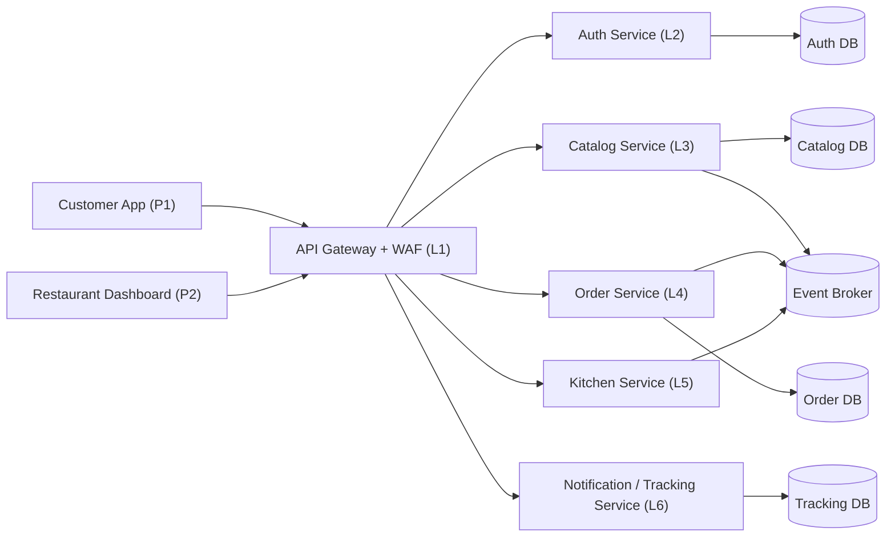

# Lab 4 - Security

## Team Information

- Manuel Alejandro Navas Bohorquez
- German Camilo Bernal Ladino
- Edwin Felipe Pinilla Peralta
- Juan David Rivera Buitrago
- Obed Felipe Espinosa Angarita

## Pattern Selected

**Web Application Firewall (WAF)**.

The WAF pattern was selected because DELIUNAL exposes several HTTP entry points through the API Gateway: authentication, catalog, orders, kitchen, promotions, and timeline. These endpoints receive user-controlled data from the customer app and the restaurant dashboard. A WAF at the gateway protects the real request path before traffic reaches internal services, without duplicating attack-detection code in each microservice.

Tradeoff considered:

- **Secure Channel** is essential, but the current lab asks for one pattern and the local Docker prototype is still mostly HTTP. TLS would improve confidentiality but would not block malicious payloads.
- **Reverse Proxy** overlaps with the existing API Gateway. Adding another proxy would increase operational complexity without materially improving request inspection.
- **Network Segmentation** would reduce blast radius, but the current compose already exposes several service ports for development. A proper segmentation refactor is valuable, but it is broader and riskier before the next feature.
- **WAF** gives the best immediate security impact at the public boundary, with a small and auditable change in one component.

## Architectural View



The WAF is embedded in the API Gateway request pipeline. Every request from the customer app or restaurant dashboard is inspected before it reaches any backend service.

## Technical Guide

### 1. Pattern Description

A Web Application Firewall inspects incoming HTTP requests against a configurable rule set. It blocks suspicious requests before they reach application code, and logs the blocked event for observability.

Security tactic: **Detect Service Denial / Detect Attack**.

The implemented WAF checks:

- SQL injection signatures in path, query string, and JSON body.
- Cross-site scripting signatures in path, query string, and JSON body.
- Path traversal signatures in URL paths.
- Oversized requests using `Content-Length`.

### 2. Quality Scenario

| Element | Description |
| --- | --- |
| Source | External attacker using the public customer or restaurant web interface. |
| Stimulus | Sends a malicious HTTP request containing SQL injection, XSS, path traversal, or an oversized body. |
| Artifact | API Gateway and the downstream auth, catalog, order, kitchen, and tracking endpoints. |
| Environment | Normal production-like operation through Docker Compose, with public clients calling `api-gateway:4000`. |
| Response | The API Gateway WAF detects the malicious signature, logs the rule, returns `403` or `413`, and does not forward the request to internal services. |
| Response Measure | 100% of requests matching the configured WAF rules are blocked before routing; clean requests continue to the existing route handlers. |

### 3. Implementation Steps

1. Add WAF configuration to the API Gateway environment schema:
   - `WAF_ENABLED`
   - `WAF_MODE`
   - `WAF_MAX_BODY_BYTES`
2. Add a reusable rule engine in `apps/api-gateway/src/security/waf.rules.ts`.
3. Add Express middleware in `apps/api-gateway/src/security/waf.middleware.ts`.
4. Register the WAF after JSON parsing and request ID assignment, but before access logging and route forwarding.
5. Expose WAF configuration in `apps/api-gateway/.env.example`.
6. Enable WAF blocking mode in the root `docker-compose.yml` for the `api-gateway` service.
7. Add a lightweight executable rule test with `npm run test:waf`.

### 4. Configuration and Code Snippets

Gateway configuration:

```env
WAF_ENABLED=true
WAF_MODE=block
WAF_MAX_BODY_BYTES=1048576
```

Middleware placement:

```ts
app.use(express.json({ limit: env.BODY_LIMIT }));
app.use(requestIdMiddleware);
app.use(wafMiddleware);
app.use(accessLogMiddleware);
app.use(rootRouter);
```

WAF modes:

- `block`: suspicious requests are rejected with `403` or `413`.
- `detect`: suspicious requests are logged but still forwarded. This is useful for tuning rules before enforcing them.

### 5. Results and Improvements

Commands executed:

```powershell
cd apps/api-gateway
npm run test:waf
npm run build
```

Runtime smoke test:

```powershell
curl.exe -i http://localhost:4099/health
curl.exe -i "http://localhost:4099/health?search=%27%20OR%201%3D1%20--"
curl.exe --path-as-is -i "http://localhost:4099/%2e%2e/%2e%2e/etc/passwd"
```

Observed result:

- Clean request samples are allowed by the rule engine.
- SQL injection samples are classified as `SQL_INJECTION`.
- XSS samples are classified as `CROSS_SITE_SCRIPTING`.
- Path traversal samples are classified as `PATH_TRAVERSAL`.
- Oversized request samples are classified as `PAYLOAD_TOO_LARGE`.
- TypeScript build passes, confirming that the WAF integrates with the existing Gateway codebase.
- Runtime clean traffic returns `HTTP 200` from `/health`.
- Runtime SQL injection traffic returns `HTTP 403` before reaching any backend route.
- Runtime path traversal traffic sent with `--path-as-is` returns `HTTP 403` before route normalization hides the attack shape.

Observed blocked response:

```json
{
  "error": {
    "code": "FORBIDDEN",
    "message": "Request blocked by WAF: SQL Injection",
    "requestId": "<x-request-id>",
    "details": {
      "ruleId": "SQL_INJECTION",
      "matchedOn": "query"
    }
  }
}
```

### 6. Recommendations

1. Start with `WAF_MODE=detect` in a real production environment to collect false positives before enabling `block`.
2. Keep WAF rules close to the API Gateway because it is the public boundary, but avoid putting business validation in WAF rules. Business validation belongs to the services.
3. Replace custom regex rules with a maintained rule set such as OWASP CRS if the system moves behind Nginx, Envoy, ModSecurity, Cloudflare, or AWS WAF.
4. Monitor WAF logs by `ruleId`, `matchedOn`, and `requestId` so blocked requests can be traced end-to-end.

## Pull Request

Implementation branch: `codex/lab4-security-waf`.

Pull request URL: add the repository PR URL here after opening the PR toward the prototype branch.
