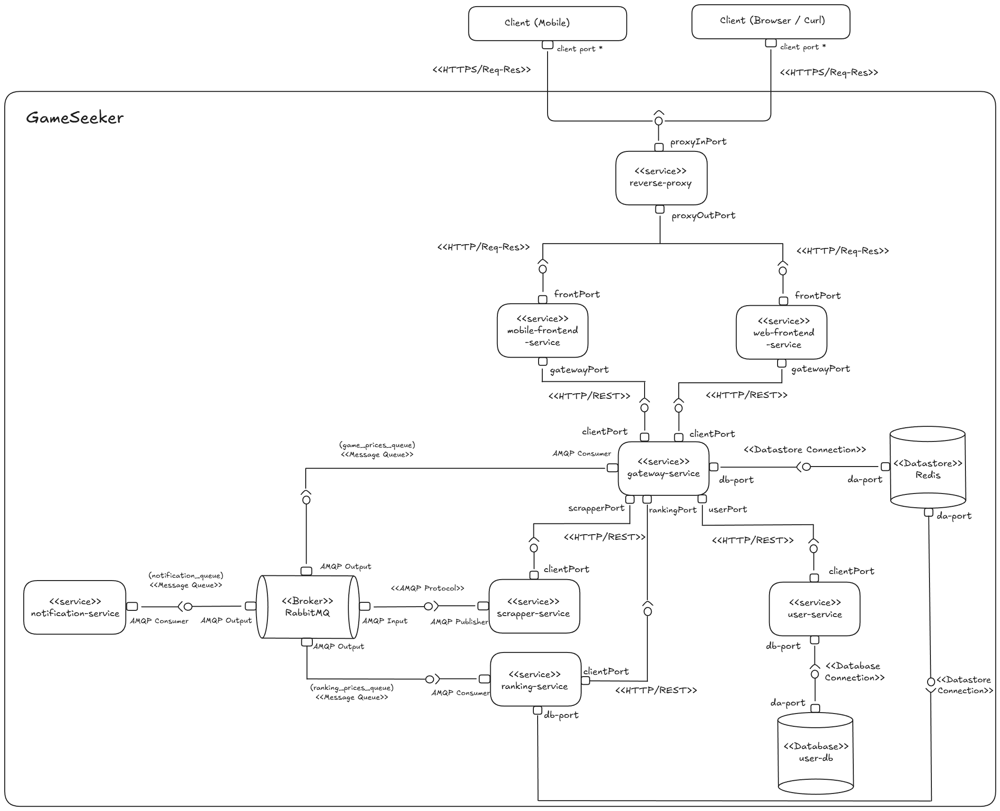
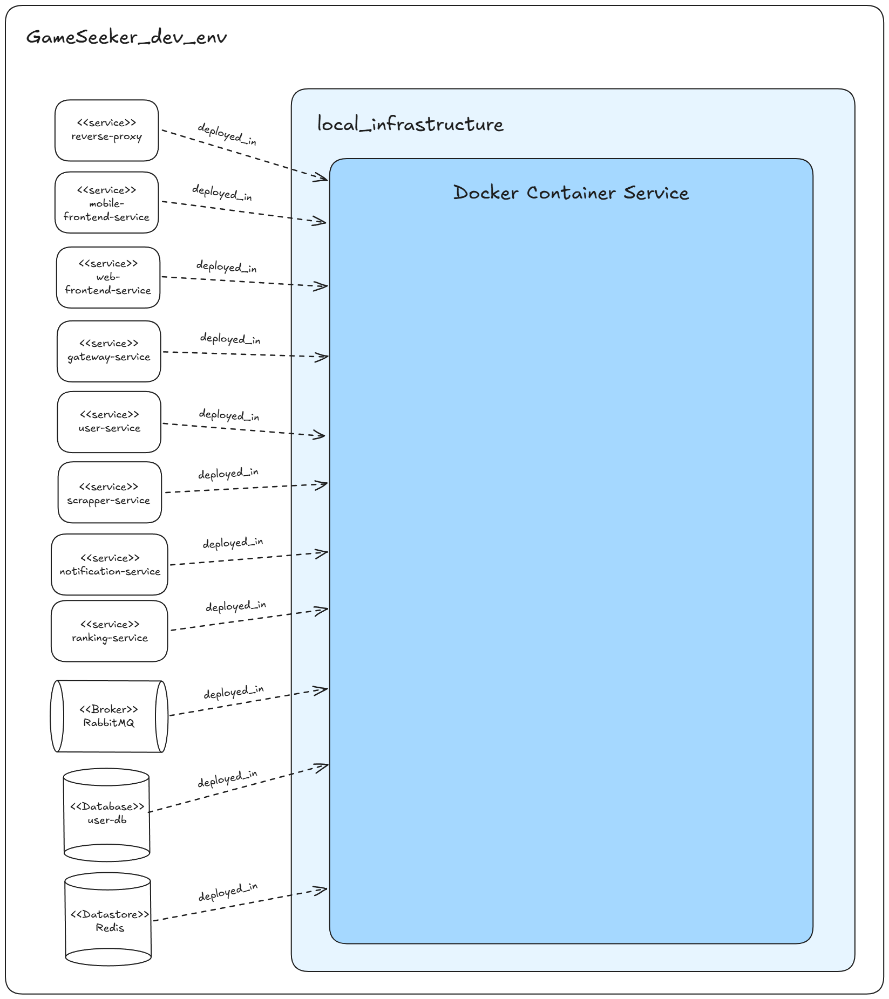
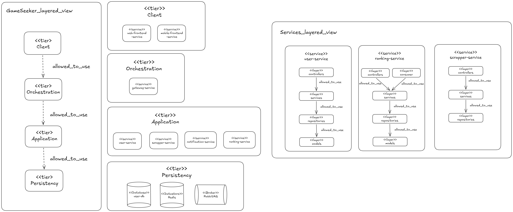
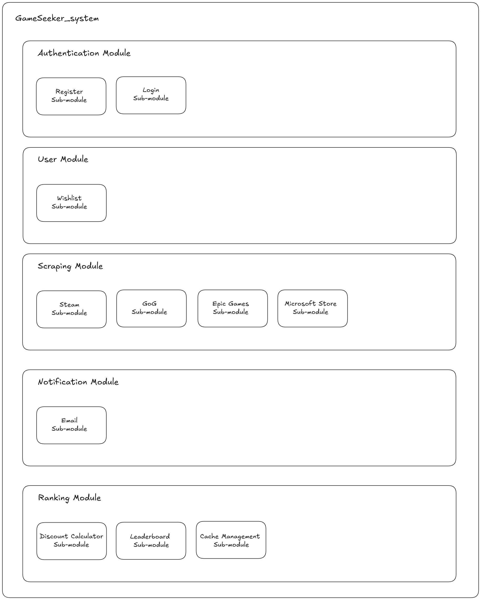

<div align="center">
  <h1>GameSeeker</h1>
  <p><i>A unified platform to discover and track gaming deals across the digital landscape.</i></p>
</div>

GameSeeker is a web application designed to help gamers find the best prices for their favorite games across multiple digital storefronts (Steam, Epic Games, GOG) and manage a centralized wishlist. 

This project is built using a **Service-Oriented architecture** to ensure scalability, modularity, and separation of concerns.

---

# Prototype 2 - Delivery Document

This section contains the formal architectural documentation required for the Prototype 2 delivery.

## 1. Team
- Alejandro Arguello Muñoz
- Miguel Angel Buitrago Castillo
- Tomas Felipe Garzon Gomez
- Juan Sebastian Umaña Camacho
- Juan Luis Vergara Novoa

## 2. Software System
- **Name:** GameSeeker
- **Logo:**  
  
- **Description:** GameSeeker is a web application designed to help gamers find the best prices for their favorite games across multiple digital storefronts (Steam, Epic Games, GOG) and manage a centralized wishlist.


## 3. Platform Requirements

### 3.1. Functional Requirements

- **Game Search and Deal Tracking:** Users can search for games across varying storefronts (Steam, Epic, GOG) and find the best globally tracked deals.
- **Wishlist Management:** Users possess a centralized wishlist that they can modify.
- **Ranking and Trending Services:** The system tracks the top deals and price discounts dynamically via a leaderboard mechanism.
- **Notifications:** Users are alerted (via Email) when desired outcomes around deals are met.
- **Authentication:** Standard authentication registration and login schemas for user accounts.

### 3.2. Non-Functional Requirements

- **The software system must follow a distributed architecture.**
  *Fulfilled by utilizing a service-oriented architecture ecosystem natively separating domains (gateway, user, scrapper, ranking).*

- **The software system must include at least two different presentation-type components (one of them: web front-end).**
  *Fulfilled by the main Next.js web front-end UI and a secondary mobile application*

- **The web front-end must follow an SSR (Server-Side Rendering) subarchitecture.**
  *Fulfilled by Next.js 15 inside the `frontend-service`, natively optimizing SEO and initial loads with SSR.*

- **The software system must include at least four logic-type components.**
  *Fulfilled by `user-service`, `scrapper-service`, `ranking-service`, and `notification-service`.*

- **The software system must include at least one component that allows communication/orchestration between the logical components.**
  *Fulfilled by the `gateway-service` acting as an orchestrator/router, bridging requests seamlessly across domains.*

- **The software system must include at least four data-type components (including relational and NoSQL databases).**
  *Fulfilled by `user-db` (PostgreSQL relational database), `Redis` (NoSQL volatile data cache store), `RabbitMQ` (as an infrastructure message/queue datastore), and `SQLite` (lightweight embedded relational database).*

- **The software system must include at least one component that is responsible for handling asynchronous processes within the system.**
  *Fulfilled by `RabbitMQ`, capturing and forwarding asynchronous telemetry across event queues like `game_prices_queue`.*

- **The software system must include a set of HTTP-based connectors.**
  *Fulfilled by RESTful connections communicating vertically (client -> gateway -> internal services) and externally against storefront endpoints.*

- **The software system must be built using at least four different general-purpose programming languages.**
  *Fulfilled by our polyglot setup containing TypeScript (Frontend, Gateway, User, Notification), Python (Scrapper), Java (Ranking), and Swift (Mobile Application).*

- **The deployment of the software system must be container-oriented.**
  *Fulfilled leveraging Docker and Docker Compose for transparent virtualized deployments.*

---

## 4. Architectural Structures

### 4.1. Component-and Connector (C&C) Structure

**C&C View**



**Description of architectural elements and relations**
- **Client**: Initiates interactions via browser or raw fetches. Communicates securely with the frontend and gateway.
- **frontend-service**: Serves the user interface and acts as the immediate client access layer routing dynamic queries to the gateway.
- **gateway-service**: The core REST reverse-proxy. Protects access to backend paths dynamically routing to `scrapper-service`, `ranking-service`, and `user-service`. Persists connection to a `Redis` datastore for idempotency/blocking logic and acts as an AMQP Consumer for event-driven pricing flows.
- **scrapper-service**: External system boundary service scraping and pushing parsed responses autonomously wrapped as AMQP packages to `RabbitMQ`.
- **ranking-service**: Interacts synchronously with `user-db` for permanent configurations and accesses dynamic price data decoupled via `RabbitMQ`. 
- **notification-service**: Consumer isolated module strictly receiving triggers from the MQ.
- **Datastores**: `RabbitMQ` holds traffic asynchronously, `user-db` holds core domains, and `Redis` accelerates caching. 

**Description of architectural styles and patterns used**
- **Service-Oriented Architecture (SOA):** Core logic handles domains completely independent.
- **Publish-Subscribe (Pub/Sub):** Mediated by the RabbitMQ Message broker managing the queue traffic between scrapers, rankings, notifications, and gateways.
- **Client-Server & Pipe-and-Filter:** Synchronous streams filtered internally within the Gateway boundaries.
- **Layered Domain Architecture (User Service):** A data-centric pattern naturally separating concerns. The logic strictly follows a defined internal flow: **Route $\rightarrow$ Controller $\rightarrow$ Service $\rightarrow$ Repository**. 
- **Event-Driven UI:** The visual interface reacts instantly to price events pushed asynchronously from the server (Streaming SSE) without the need for manual page refreshes or costly constant polling.

### 4.2. Deployment Structure

**Deployment View**



**Description of architectural elements and relations**
- **local_infrastructure**: Represents the hardware and operating environment executing the stack.
- **Docker Container Service**: Interfacing runtime allocating network subnets and execution spaces.
- **Containers**: Eight natively segregated instances representing individual `deployed_in` mappings: Backend Services (`frontend-service`, `gateway-service`, `user-service`, `scrapper-service`, `notification-service`, `ranking-service`) and backing tools (`RabbitMQ`, `user-db`, `Redis`).

**Description of architectural patterns used**
- **Containerization Pattern**: Every module runs an isolated image holding its specific polyglot runtime ensuring absolute system portability across all machines.

### 4.3. Layered Structure

**Layered View**



**Description of architectural elements and relations**
- **Client Tier**: Direct consumer hardware abstractions. Interacts with the `Orchestration` tier using verified paths.
- **Orchestration Tier**: Represents the ingress API gateway deciding whether a request is authenticated (`allowed_to_use`) to permeate core services.
- **Application Tier**: Houses independent operational nodes (`user-service`, `scrapper-service`, `notification-service`, `ranking-service`). Additionally, individual nodes strictly separate logical inner flows as controllers -> services -> repositories -> models.
- **Persistency Tier**: Central storage mechanisms like relational `user-db`, temporary `Redis` stores, and `RabbitMQ` systems. Shielded entirely from exterior access.

**Description of architectural patterns used**
- **Layered Architecture**: Information strictly flows inward through `allowed_to_use` directives, preventing client bypassing to core Application logic or Persistency layer. 

### 4.4. Decomposition Structure

**Decomposition View**



**Description of architectural elements and relations**
- **Authentication Module**: Isolates Register and Login Sub-modules dynamically.
- **User Module**: Controls the internal Wishlist state and boundaries.
- **Scraping Module**: Groups discrete provider engines (Steam, GoG, Epic Games, Microsoft Store).
- **Notification Module**: Configures outgoing Email and alerting strategies.
- **Ranking Module**: Structures calculation hierarchies (Discount Calculator, Leaderboard algorithms, and volatile Cache Management sub-blocks).

---

## 5. Quality Attributes

### 5.1. Security

#### Security Scenarios

| Attribute | Scenario 1: Direct Service Access & Traffic Interception |
|---|---|
| **Source** | External (attacker or malicious user) |
| **Stimulus** | An attacker attempts to directly access internal microservice ports or intercept network traffic between the client and the server to read sensitive data (e.g., credentials or session tokens). |
| **Artifact** | Application communication network and exposed ports. |
| **Environment** | The system is under normal operation when the stimulus occurs. |
| **Response** | The system exposes only the Reverse Proxy port, rejecting any direct connection attempt to underlying services. Simultaneously, the communication channel enforces TLS encryption, preventing any reading or modification of data packets in transit. |
| **Response Measure** | 100% of direct connection attempts to internal ports from the host are denied (`Connection Refused`), and 100% of external client-server communication is successfully encrypted over HTTPS. |

| Attribute | Scenario 2: Malicious Header Injection |
|---|---|
| **Source** | External (attacker crafting a malicious HTTP request) |
| **Stimulus** | An attacker sends a request with a forged or injected `Host` header attempting to manipulate internal routing logic, bypass access controls, or trigger unintended behavior in backend services. |
| **Artifact** | The HTTP request pipeline between the client and the `gateway-service`. |
| **Environment** | The system is under normal operation when the stimulus occurs. |
| **Response** | The `reverse-proxy` intercepts all inbound requests, strips the `Host` header before forwarding, and routes the sanitized request to the appropriate internal service. Backend services never receive raw, unfiltered client headers. |
| **Response Measure** | 100% of inbound requests have their `Host` header removed by the proxy before reaching any internal microservice, neutralizing host-header injection as an attack vector. |

---

#### Applied Architectural Tactics

- **Limit Access (Resist Attack):** All internal microservice ports and database ports are unexposed at the Docker host level. The only externally reachable port is `8443`, mapped to the `reverse-proxy` container. Direct `curl` attempts to internal service ports (e.g., `http://localhost:4000/`) result in `Connection Refused`.

- **Encrypt Data (Detect Attacks):** TLS/SSL termination is handled at the `reverse-proxy` boundary via self-signed certificates generated with `openssl` (RSA 4096-bit). The `uvicorn` server boots with `--ssl-keyfile` and `--ssl-certfile` flags, ensuring all external traffic is encrypted. Internal container-to-container communication operates over plain HTTP within the isolated Docker network, avoiding unnecessary certificate management overhead.

- **Authenticate Actors:** Session tokens (e.g., `better-auth.session_token`) are transmitted exclusively over the encrypted HTTPS channel, reducing the risk of token theft via network interception. Trusted CORS origins are explicitly scoped to `https://localhost:8443` in both `gateway-service` and `user-service`.

- **Sanitize Input:** The `reverse-proxy` strips the `Host` header from all incoming requests before forwarding them downstream, preventing host-header injection attacks against internal routing logic.

---

#### Applied Architectural Patterns

- **Reverse Proxy:** An intermediary `reverse-proxy` service (implemented in FastAPI) acts as the sole entry point to the system. It intercepts all external requests, captures client IPs, removes malicious headers, and routes traffic to the appropriate internal service (`gateway-service` or `frontend-service`). The internal topology and ports of all microservices remain completely hidden from the outside network.

- **Secure Channel (HTTPS/TLS):** The `reverse-proxy` acts as the SSL termination point for the entire system. A `start.sh` initialization script automatically generates self-signed TLS certificates using `openssl` on first boot, and a Docker volume (`certs-data`) persists them across container restarts. This pattern guarantees confidentiality and integrity of data in transit — any attacker intercepting the external network sees only ciphertext. Internal traffic between the proxy and microservices runs over plain HTTP within the isolated `app-network`, avoiding redundant encryption overhead.

> **Implementation note:** The two patterns are applied in tandem by design. The Reverse Proxy alone would leave the external Client ↔ Proxy leg vulnerable to interception. Layering the Secure Channel on top converts the proxy into the SSL termination point, securing external traffic while keeping the internal Docker network lightweight.

### 5.2. Performance and Scalability

#### Performance Scenarios

| Attribute | Scenario 1: Scrapper Saturation Under Concurrent Search Load |
|---|---|
| **Source** | Many concurrent users (or automated clients) issuing game-search requests. |
| **Stimulus** | A surge of concurrent `search`/`compare` requests that a single `scrapper-service` instance cannot serve without becoming a bottleneck (scraping is the most CPU/IO-intensive workload). |
| **Artifact** | The `scrapper-service` tier and the `scrapper-lb` load balancer. |
| **Environment** | The system is under increasing concurrent load. |
| **Response** | The `scrapper-lb` distributes incoming requests across multiple `scrapper-service` replicas according to a configurable algorithm, spreading the workload horizontally instead of queuing it on a single instance. |
| **Response Measure** | The search workload is shared across **N = 3** replicas; aggregate capacity scales by adding replicas with no code changes. The balancing strategy is selectable (`round_robin`, `least_connections`, `weighted`). |

| Attribute | Scenario 2: Request Flood / Resource Exhaustion on Search |
|---|---|
| **Source** | Concurrent users or an automated load-testing client (Apache JMeter). |
| **Stimulus** | Bursts of requests to `GET /api/games/search` that could overwhelm the scrapper tier and the external stores it depends on. |
| **Artifact** | `gateway-service`, its `rateLimiter` middleware, Redis, and the downstream scrapper tier. |
| **Environment** | The system is under increasing concurrent load (or abuse). |
| **Response** | The gateway admits requests within the per-client quota and rejects excess requests with `429 Too Many Requests` **before** they reach the scrapper tier, shielding downstream resources. |
| **Response Measure** | Up to **10 requests per client IP per minute** are forwarded; all excess requests return `429` with `Retry-After` and `X-RateLimit-*` headers (verified via JMeter — see analysis below). |

#### Applied Architectural Tactics

- **Introduce Concurrency / Maintain Multiple Copies of Computations:** The scrapper workload runs as multiple identical replicas (`scrapper-service-1/2/3`) behind the `scrapper-lb`, so independent requests are processed in parallel rather than serialized on one instance.
- **Load Balancing:** The balancer supports `least_connections` (recommended for GameSeeker), which accounts for the highly variable duration of scraping different stores, sending each new request to the least-busy replica.
- **Manage Work Requests — Control Resource Demand (Throttling):** The gateway caps the request rate per client using a Redis sliding-window counter, bounding the load that can reach the scrapper tier and the external storefronts.

#### Applied Architectural Patterns

- **Load Balancer Pattern:** `scrapper-lb` (FastAPI) is the single ingress to the scrapper tier and fans requests out to the three replicas using one of three pluggable strategy classes (round-robin, least-connections, weighted). It exposes `GET /lb-status` for backend visibility. See `performance-scalability/load-balancer/`.
- **Throttling Pattern:** Implemented as `gateway-service/src/middleware/rateLimiter.ts` and applied to `GET /api/games/search`. Each request is recorded in a Redis sorted set (`ratelimit:search:<ip>`) scored by timestamp; entries older than the 60-second window are evicted before counting, and requests beyond 10/min are rejected with `429`. See `performance-scalability/throttling/`.

#### Performance Testing Analysis and Results

Load testing was performed with **Apache JMeter** (plans in `jmeter/`). The **throttling** scenario is the representative performance test, as it produces a clean, reproducible signal independent of external dependencies.

**Throttling — `jmeter/gameseeker-throttling-loadtest.jmx`** against `GET /api/games/search?name=Cyberpunk` (results in `jmeter/throttling_tests_results/`):

| Concurrency | Behaviour observed |
|---|---|
| 1 user | Request served normally — `200 OK`, ~2.6 s (full scrape). |
| 50 / 200 / 500 users | The first ~10 requests per IP per minute are served; **every excess request returns `429`** within **3–9 ms**. |

**Analysis:** The throttle sheds excess load **early and cheaply** — rejected requests are answered in single-digit milliseconds at the gateway and never consume scrapper or external-store resources. This confirms the tactic bounds resource demand under bursty load exactly as designed.

**Load balancer — note on measurement.** A with/without-balancer comparison was also run at 1/50/200/500 concurrency (`jmeter/summaryN-lb.csv` vs `summaryN-sinLT.csv`). The standalone balancer benchmark drives three scrapper replicas that each call **live external storefronts**; under concurrency those external sites rate-limit/refuse the scrapers, so the with-balancer runs are dominated by **upstream failures (78–98% errors)** rather than measuring the balancer itself. We therefore do not draw a throughput conclusion from those runs and treat throttling as the representative performance test. A clean balancer micro-benchmark against a non-scraping endpoint (e.g. `/api/v1/games/health`) is identified as the next step to isolate the balancer's distribution behaviour from external-store variability.

### 5.3. Reliability

#### Reliability Scenarios

| Attribute | Scenario 1: Gateway Instance Failure (High Availability) |
|---|---|
| **Source** | Internal fault — process crash, container failure, or node pressure. |
| **Stimulus** | A `gateway-service` instance crashes or is killed during normal operation. |
| **Artifact** | `gateway-service` — the system's entry point and orchestrator (a single point of failure if run as one instance). |
| **Environment** | The system is under normal operation. |
| **Response** | Kubernetes runs the gateway as a `Deployment` of **2 replicas** behind a `Service`. Liveness/readiness probes detect the failed Pod, the control plane recreates it automatically, and the Service keeps routing traffic to the healthy replicas. |
| **Response Measure** | The desired replica count is restored **automatically with no manual intervention**; surviving replicas continue serving traffic throughout. Self-healing (delete Pod → recreated) and scaling (2 → 4 → 2) were both demonstrated on minikube. |

| Attribute | Scenario 2: Ranking Node Failure (Fault Tolerance, Zero State Loss) |
|---|---|
| **Source** | Internal fault — process crash / container failure of the active ranking node. |
| **Stimulus** | The active `ranking-service` instance stops responding. |
| **Artifact** | The ranking subsystem (deal-leaderboard read path). |
| **Environment** | Normal operation, under a live stream of price events. |
| **Response** | `ranking-active` and `ranking-spare` both consume **every** price event in parallel from a RabbitMQ **fanout exchange** (keeping identical leaderboards in shared Redis). A coordinator health-checks both nodes and promotes the hot spare the instant the active fails, then fails back on recovery. |
| **Response Measure** | Failover completes in **≈0.5 s** (detection-dominated; the state takeover itself is sub-millisecond), with **zero leaderboard entries lost** and no client-visible errors on subsequent reads. |

#### Applied Architectural Tactics

- **Fault Detection — Ping/Monitor & Health Check:** Kubernetes liveness/readiness probes on the gateway's `/health`; the ranking coordinator actively polls `/api/v1/ranking/health` on both nodes every 250 ms.
- **Recovery — Reintroduction (Redundant Spare):** The cluster automatically restarts/reschedules failed gateway Pods; the ranking coordinator promotes the spare and later fails back to the recovered active node.
- **Active Redundancy (Redundant Spare):** Both ranking nodes process identical inputs in parallel, so the spare's state is always synchronized with the active — enabling sub-millisecond, lossless takeover.
- **Load Balancing / Maintain Multiple Copies:** The gateway `Service` spreads traffic across replicas, so the cluster keeps serving when any single replica is lost.

#### Applied Architectural Patterns

- **Cluster Pattern (Active/Active):** The gateway is deployed as a Kubernetes `Deployment` (2 replicas) exposed by a `Service`, with health probes and automatic reconciliation. Every replica serves traffic simultaneously; the gateway is stateless, so no node sits idle and losing a Pod never loses state. Manifests in `k8s/`.
- **Active Redundancy / Hot Spare:** The ranking node is duplicated into an active and a hot spare, both fed by a RabbitMQ fanout exchange and fronted by a health-aware coordinator that performs automatic failover and failback. Implementation in `reliability/` (coordinator, fanout topology, demo stack).

> **Full technical guide, Kubernetes manifests, and captured evidence** (self-healing, scaling, and a measured ~519 ms lossless failover) are in [`reliability/README.md`](./reliability/README.md) and [`reliability/Lab6-Reliability-GameSeeker.pdf`](./reliability/Lab6-Reliability-GameSeeker.pdf). Delivery PR: https://github.com/unal-sw-arch/swarch-2026i/pull/31

### 5.4. Interoperability

#### Interoperability Scenarios

| Attribute | Scenario 1: External Data Extraction and Integration |
|---|---|
| **Source** | Internal system timer (Scheduled Poll) |
| **Stimulus** | The system needs to retrieve, parse, and normalize game prices from external digital stores (Steam, Epic Games, GOG, Microsoft Store) whose data structures are completely distinct and out of our control. |
| **Artifact** | `scrapper-service` and its integration with `RabbitMQ`. |
| **Environment** | The system is under normal operation when the stimulus occurs. |
| **Response** | The `scrapper-service` queries the external platforms, extracts the data, handles format discrepancies using an Anti-Corruption Layer, transforms the heterogeneous data into our canonical internal domain model, and publishes the standardized data to `RabbitMQ` asynchronously. |
| **Response Measure** | 100% of the successfully scraped data is normalized to the internal schema before being pushed to the internal queues, effectively shielding all internal services (Gateway, Ranking) from external HTML/API changes. |

---

#### Applied Architectural Tactics

- **Asynchronous Messaging (Choreography):** The system relies on `RabbitMQ` to decouple the external interaction from the internal operation. Instead of forcing internal microservices to wait for slow HTTP requests to third-party stores, the scrapper obtains data at its own pace and publishes it as events (`game_prices_queue`, `ranking_prices_exchange`).
- **Polling (Scheduled Job):** Since external stores do not proactively notify our system of price changes, the `scrapper-service` implements an active polling mechanism (`SCRAPPER_LOOP_INTERVAL_MINUTES`). This tactic ensures that our internal data remains continuously synchronized with the external state without requiring direct integration from the external providers.

---

#### Applied Architectural Patterns

- **Anti-Corruption Layer (ACL):** The `scrapper-service` acts as an isolating barrier. It prevents the complex, inconsistent, or undocumented data models of external digital stores from leaking into our system. It translates external data (raw HTML from Steam or JSON from Epic) into our internal, standardized Game and Price objects before they reach the rest of the application.
- **Adapter / Wrapper Pattern:** Within the `scrapper-service` module, specific adapter engines are implemented for each external store (e.g., Steam Scraper, GOG Scraper). These wrappers encapsulate the specific logic and endpoints required to interact with each store, exposing a unified scraping interface to the main scrapper loop.

## 6. Prototype

**Instructions for deploying the software system locally.**

To lift the GameSeeker prototype distributed architecture locally, you will need **Docker Desktop** running alongside **Docker Compose**.

1. **Environment Configuration (Crucial):** Before building the containers, you must ensure the secret keys are present in their respective service directories. The system will fail to initialize if these are missing:
    * **User Service:** Place the `BETTER_AUTH_SECRET` in `/user-service/.env`.
    * **Notification Service:** Place the `RESEND_API_KEY` in `/notification-service/.env`.

> **WARNING:** The deployment pipeline will be interrupted if the `.env` files are not correctly mapped. Please ensure the provided environment files are placed in the specific service folders before running the build command.

2. Open your terminal or bash IDE and navigate to the project's root folder (`/GameSeeker/`).
3. Trigger the pipeline to build and start the cluster securely in the background:
    ```bash
    docker-compose up --build -d
    ```
4. Docker will initialize the network sequence, launching data persistence nodes (`postgres, rabbitmq, redis`) concurrently followed by core application logic nodes via the Dockerfile maps. All external traffic is routed through a single entry point:
    * **Application Entry Point (Reverse Proxy):** `https://localhost:8443`

> **⚠️ Important — Self-Signed Certificate Warning:** Since the system uses a locally generated self-signed TLS certificate, your browser will display a security warning (e.g., `ERR_CERT_AUTHORITY_INVALID` in Chrome, or "Your connection is not private" in other browsers) when first accessing `https://localhost:8443`. This is expected behavior in a local development environment. To proceed, click **"Advanced"** and then **"Continue to localhost (unsafe)"** (or the equivalent option in your browser). You will only need to do this once per browser session.    
5. After tests successfully finish, clean up the subnets safely from memory overhead:
    ```bash
    docker-compose down
    ```
