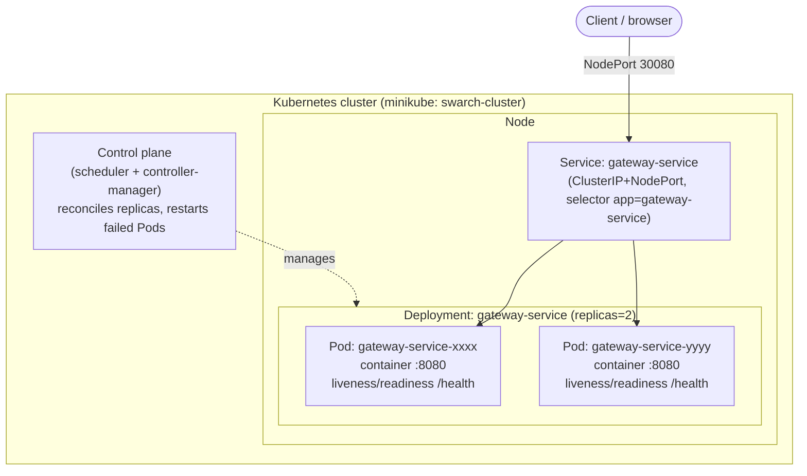
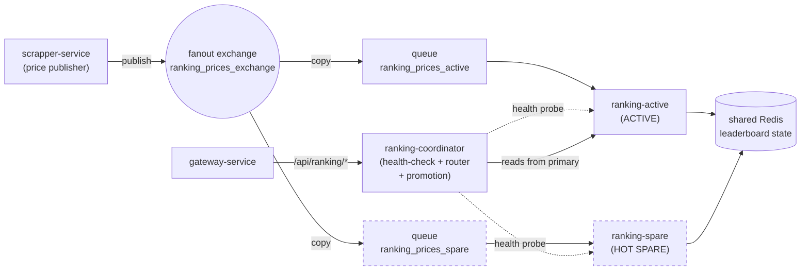

# Laboratory 6 — Reliability (GameSeeker)

**Course:** Software Architecture · 2026-I
**Project:** GameSeeker — distributed game-deal discovery platform

This document is the technical guide for Lab 6. It covers **Part A — Cluster
Pattern** (Kubernetes) and **Part B — Active Redundancy / Hot Spare**, both
implemented as real contributions to the GameSeeker project.

---

## 1. Team Information

- Alejandro Arguello Muñoz
- Miguel Angel Buitrago Castillo
- Tomas Felipe Garzon Gomez
- Juan Sebastian Umaña Camacho
- Juan Luis Vergara Novoa

---

## 2. Architectural Views

### 2.1 Cluster Pattern (Part A) — Deployment view

The **gateway-service** (the system's single entry point / orchestrator) is
deployed as a Kubernetes `Deployment` of **2 replicas** behind one `Service`.
Clients reach a single stable endpoint; kube-proxy load-balances across the
ready Pods. The control plane continuously reconciles desired vs. actual state,
restarting or rescheduling Pods on failure.



**New infrastructure introduced:** a local Kubernetes cluster (minikube), the
`gateway-service` Deployment, and the `gateway-service` Service
(`k8s/gateway-deployment.yaml`, `k8s/gateway-service.yaml`).

### 2.2 Active Redundancy / Hot Spare (Part B) — C&C view

The **ranking-service** is duplicated into an **active** and a **hot spare**
node. A RabbitMQ **fanout exchange** delivers every price event to *both*
nodes, so both keep fully synchronized leaderboards (state in shared Redis). A
**coordinator** health-checks both nodes, serves leaderboard reads from the
active, and promotes the spare the instant the active fails.



**New infrastructure introduced:** the fanout exchange `ranking_prices_exchange`,
a second ranking node (`ranking-spare`), and the `ranking-coordinator`
(`reliability/ranking-coordinator/`). State synchronization mechanism =
**parallel consumption of the fanout exchange + shared Redis**.

---

## 3. Technical Guide — Part A: Cluster Pattern

### 3.1 Pattern description

The **Cluster Pattern** groups multiple identical nodes under a unified
management layer so they behave as a single logical machine. Kubernetes
implements it natively: containers run in **Pods**, Pods are grouped by a
**Deployment**, and a **Service** exposes them behind one stable endpoint. The
control plane supplies the reliability tactics:

- **Fault detection** — liveness/readiness probes on `/health`.
- **Recovery / redundant spare** — the Deployment keeps `replicas` Pods alive;
  a deleted or crashed Pod is recreated automatically.
- **Load balancing** — the Service spreads traffic across ready Pods.

### 3.2 Implemented cluster type

**Active/Active.** Every gateway replica serves traffic simultaneously. We chose
Active/Active because the gateway is **stateless** (it only routes/validates and
holds no session state), so there is no benefit to keeping a node idle: running
all replicas hot maximizes both throughput and fault tolerance, and losing a Pod
never loses state. This contrasts with the Active/Passive model we use for the
ranking node in Part B, where a designated spare stands by behind a coordinator.

### 3.3 Implementation steps

1. Add a hostname-reporting `/health` endpoint to the gateway so probes have a
   target and load-balancing across replicas is observable
   (`gateway-service/src/index.ts`).
2. Author the Kubernetes manifests (`k8s/gateway-deployment.yaml`,
   `k8s/gateway-service.yaml`).
3. Start a local cluster: `minikube start -p swarch-cluster`.
4. Build the gateway image straight into minikube's Docker daemon
   (`eval $(minikube -p swarch-cluster docker-env)` → `docker build`).
5. `kubectl apply -f k8s/gateway-deployment.yaml -f k8s/gateway-service.yaml`.
6. Demonstrate self-healing (`kubectl delete pod …`) and scaling
   (`kubectl scale deployment/gateway-service --replicas=N`).

All of the above is automated in **`k8s/demo.sh`**.

### 3.4 Configuration snippets

Deployment (project-specific adaptations highlighted in comments — 2 replicas,
probes on the gateway's real `/health`, and the three env vars
`gateway-service/src/lib/env.ts` requires at boot):

```yaml
# k8s/gateway-deployment.yaml (excerpt)
spec:
  replicas: 2
  template:
    spec:
      containers:
        - name: gateway-service
          image: gameseeker/gateway-service:lab6
          ports: [{ containerPort: 8080 }]
          readinessProbe: { httpGet: { path: /health, port: 8080 } }
          livenessProbe:  { httpGet: { path: /health, port: 8080 } }
```

```yaml
# k8s/gateway-service.yaml (excerpt)
spec:
  type: NodePort
  selector: { app: gateway-service }
  ports: [{ port: 80, targetPort: 8080, nodePort: 30080 }]
```

### 3.5 Evidence — self-healing and scaling

Captured from `k8s/demo.sh` against minikube (`swarch-cluster`).

**Deployment up — 2 replicas behind one Service:**

```text
$ kubectl get pods -l app=gateway-service -o wide
NAME                               READY   STATUS    RESTARTS   AGE   IP           NODE
gateway-service-85bd46cc4c-46qf8   1/1     Running   0          7s    10.244.0.3   swarch-cluster
gateway-service-85bd46cc4c-7zkh5   1/1     Running   0          7s    10.244.0.4   swarch-cluster

$ kubectl get svc gateway-service
NAME              TYPE       CLUSTER-IP      EXTERNAL-IP   PORT(S)        AGE
gateway-service   NodePort   10.104.253.64   <none>        80:30080/TCP   7s
```

**Self-healing — delete a Pod, the Deployment recreates it automatically:**

```text
$ kubectl delete pod gateway-service-85bd46cc4c-46qf8
pod "gateway-service-85bd46cc4c-46qf8" deleted

$ kubectl get pods -l app=gateway-service       # count restored to 2 (new Pod -fh7nf)
NAME                               READY   STATUS    RESTARTS   AGE
gateway-service-85bd46cc4c-7zkh5   1/1     Running   0          43s
gateway-service-85bd46cc4c-fh7nf   1/1     Running   0          36s
```

**Scaling — scale to 4, then back to 2:**

```text
$ kubectl scale deployment/gateway-service --replicas=4
deployment.apps/gateway-service scaled
$ kubectl get pods -l app=gateway-service
NAME                               READY   STATUS    RESTARTS   AGE
gateway-service-85bd46cc4c-7zkh5   1/1     Running   0          50s
gateway-service-85bd46cc4c-fh7nf   1/1     Running   0          43s
gateway-service-85bd46cc4c-fp9lv   1/1     Running   0          7s
gateway-service-85bd46cc4c-phsm9   1/1     Running   0          7s

$ kubectl scale deployment/gateway-service --replicas=2   # extras Terminating
```

**Load balancing — 6 requests to the Service answered by different Pods**
(the `instance` field is the serving Pod's hostname):

```text
{"status":"ok","service":"gateway","instance":"gateway-service-85bd46cc4c-fh7nf"}
{"status":"ok","service":"gateway","instance":"gateway-service-85bd46cc4c-fh7nf"}
{"status":"ok","service":"gateway","instance":"gateway-service-85bd46cc4c-7zkh5"}
{"status":"ok","service":"gateway","instance":"gateway-service-85bd46cc4c-fh7nf"}
{"status":"ok","service":"gateway","instance":"gateway-service-85bd46cc4c-7zkh5"}
{"status":"ok","service":"gateway","instance":"gateway-service-85bd46cc4c-fh7nf"}
```

---

## 4. Technical Guide — Part B: Active Redundancy (Hot Spare)

### 4.1 Pattern description

In **Active Redundancy (Hot Spare)** every node in the protection group — active
*and* spare — receives and processes **identical inputs in parallel**, so the
spare's state is fully synchronized with the active at all times. On failure the
spare takes over with **no state loss**. It realizes the **Redundant Spare**
tactic (Recover from Faults → Preparation and Repair).

In GameSeeker we apply it to the **ranking-service** (the live deal leaderboard).
Previously a single ranking node consumed `ranking_prices_queue` — a single point
of failure. Now:

- price events are published to a **fanout exchange**, so the active and spare
  each get *every* message on their own queue (parallel identical inputs);
- both write to **shared Redis**, so their leaderboards are identical and the
  spare is genuinely hot;
- a **coordinator** detects active failure and promotes the spare in ms.

### 4.2 Quality scenario (six-part)

| Element | Value |
|---|---|
| **Source** | An internal fault — process crash / container failure of a ranking node. |
| **Stimulus** | The active `ranking-service` instance stops responding (crashes). |
| **Artifact** | The ranking subsystem (deal leaderboard read path). |
| **Environment** | Normal operation, under a live stream of price events from the scrapper. |
| **Response** | The coordinator detects the active is down via health checks and reroutes leaderboard reads to the hot spare, which already holds an identical leaderboard. |
| **Response measure** | Failover completes in **well under one second** (measured **≈0.5 s**, dominated by fault detection; the state takeover itself is sub-millisecond) with **zero leaderboard entries lost** and no client-visible errors on subsequent reads. |

### 4.3 Implementation steps

1. **Fanout topology.** `ranking-service` declares a fanout exchange and a
   per-instance queue bound to it; the `@RabbitListener` listens on that
   per-instance queue (`config/RabbitMQConfig.java`, `messaging/GamePriceConsumer.java`,
   `application.properties`).
2. **Publisher.** `scrapper-service` publishes ranking events to the fanout
   exchange instead of a single queue
   (`scrapper-service/src/repositories/brokers/rabbitmq.py`).
3. **Two nodes.** Run `ranking-active` and `ranking-spare` from the same image,
   differing only by `RANKING_INSTANCE_ID` / `RANKING_INSTANCE_QUEUE`, sharing
   one Redis.
4. **Coordinator.** A FastAPI service (`reliability/ranking-coordinator/`)
   health-checks both nodes every 250 ms, routes `/api/v1/ranking/*` reads to
   the primary, promotes the spare after 2 consecutive failures, and fails back
   when the active recovers. The gateway's `RANKING_SERVICE_URL` now points at
   the coordinator — the hot spare is transparent to the rest of the system.
5. **Run & demonstrate:**
   ```bash
   docker compose -f reliability/docker-compose.reliability.yml up --build -d
   bash reliability/failover-demo.sh
   ```

### 4.4 Configuration / code snippets

Fanout topology so both nodes get every message (state-sync mechanism):

```java
// ranking-service/.../config/RabbitMQConfig.java (excerpt)
@Bean FanoutExchange rankingExchange() { return new FanoutExchange(exchangeName, true, false); }
@Bean Queue rankingInstanceQueue()     { return new Queue(instanceQueueName, false, false, true); }
@Bean Binding rankingBinding()         { return BindingBuilder.bind(rankingInstanceQueue()).to(rankingExchange()); }
```

Coordinator promotion logic (health check → failover):

```python
# reliability/ranking-coordinator/coordinator.py (excerpt)
primary_down = state["consecutive_failures"][primary] >= FAIL_THRESHOLD
if primary_down and state["healthy"][spare]:
    _promote(spare, "FAILOVER")          # spare already hot -> zero state loss
elif FAILBACK and primary == "spare" and state["healthy"]["active"]:
    _promote("active", "FAILBACK")
```

### 4.5 Evidence — failover

Captured from `reliability/failover-demo.sh`.

**1) Steady state — both nodes hot, leaderboards identical (15 = 15):**

```json
{ "primary": "active",
  "healthy": { "active": true, "spare": true },
  "leaderboard_size": { "active": 15, "spare": 15 },
  "failover_count": 0, "last_failover_ms": null }
```

Reads are served by the active node:

```text
$ curl -D - .../api/v1/ranking/top?limit=5
x-served-by: active
x-failover-count: 0
```

**2) Fault injection — stop the active node:**

```text
$ docker stop ranking-active
```

**3) Failover — coordinator promotes the spare (~0.5 s, zero loss):**

```json
{ "primary": "spare",
  "healthy": { "active": false, "spare": true },
  "leaderboard_size": { "active": null, "spare": 15 },
  "failover_count": 1,
  "last_failover_ms": 518.6,
  "last_event": "FAILOVER: primary active -> spare (detected in ~518.6 ms)" }
```

Reads continue uninterrupted, now served by the spare — **same 15 entries, no
state lost** (the spare had been processing every price event in parallel):

```text
$ curl -D - .../api/v1/ranking/top?limit=5
x-served-by: spare
```

**4) Recovery — restart the active node, coordinator fails back:**

```json
{ "primary": "active",
  "healthy": { "active": true, "spare": true },
  "leaderboard_size": { "active": 15, "spare": 15 },
  "failover_count": 2,
  "last_event": "FAILBACK: primary spare -> active" }
```

### 4.6 Recommendations (for teams adopting this pattern)

1. **Use a fanout (or topic) exchange, not a shared queue.** With a single
   shared queue the two instances become *competing consumers* (each message
   goes to only one) — that is load-sharing, not redundancy. A fanout gives each
   node its own copy, which is what keeps the spare hot.
2. **Externalize or fully replicate state.** We put leaderboard state in shared
   Redis so promotion is instantaneous. If you keep per-node state instead, make
   absolutely sure every input reaches every node, and verify convergence (the
   coordinator's `/status` reports each node's leaderboard size for exactly this).
3. **Separate detection latency from failover latency, and tune it.** The
   takeover itself is sub-millisecond (a variable flip) because the spare is
   already synchronized; the user-visible delay is dominated by *detection*
   (`HEALTH_INTERVAL × FAIL_THRESHOLD`). Keep the threshold ≥ 2 to avoid
   flapping on transient blips, and size the interval to your latency budget.
4. **Make the spare transparent.** Putting the coordinator behind the same
   API/URL the gateway already used meant zero changes elsewhere — adopt the
   redundancy behind an existing seam rather than spreading failover logic across
   callers.

---

## 5. Pull Request

> Implementation branch: **`reliability`** → opened as a Pull Request toward the
> Prototype 3 branch of the project repository.
>
> **PR URL:** _<add the PR link here once opened>_

## 6. Reproducing everything locally

```bash
# Part A — Cluster Pattern (Kubernetes)
bash k8s/demo.sh

# Part B — Active Redundancy / Hot Spare
docker compose -f reliability/docker-compose.reliability.yml up --build -d
bash reliability/failover-demo.sh
docker compose -f reliability/docker-compose.reliability.yml down
```
