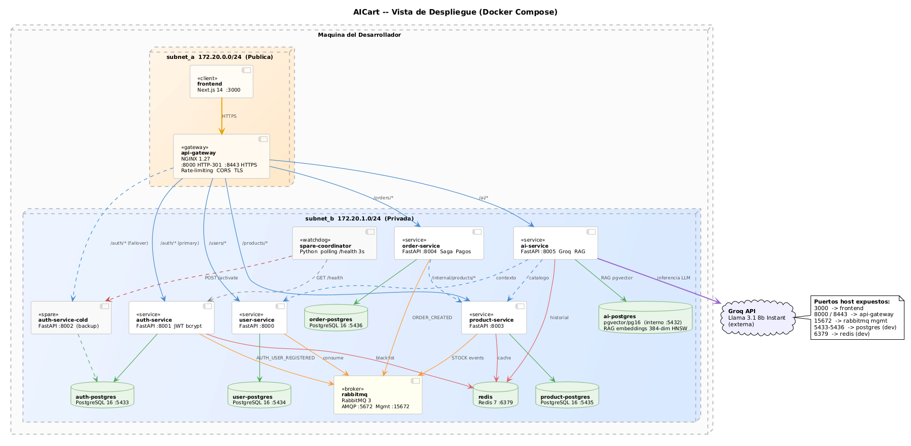
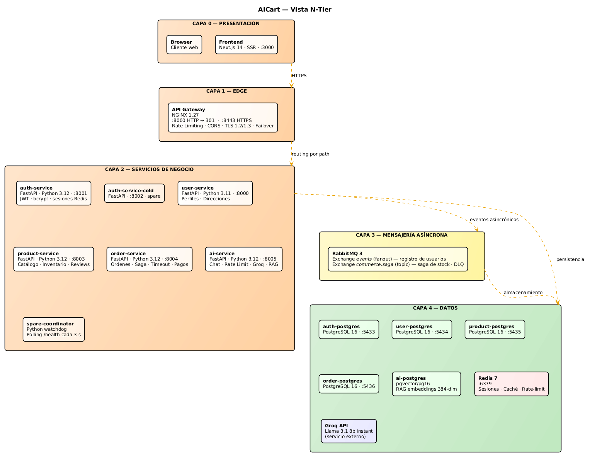
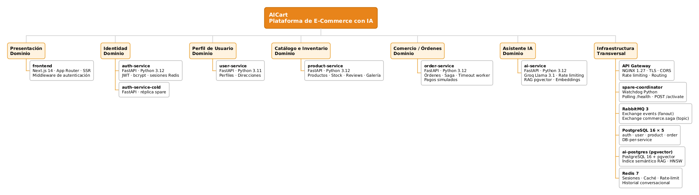

<p align="center">
  
</p>

# 🛒 AICart — Plataforma de E-Commerce con IA

[](https://www.python.org/downloads/)
[](https://nextjs.org/)
[](https://fastapi.tiangolo.com/)
[](https://www.postgresql.org/)
[](https://redis.io/)
[](https://www.rabbitmq.com/)
[](https://console.groq.com/)
[](https://www.docker.com/)
[](LICENSE)

**Plataforma de comercio electrónico basada en microservicios** que permite a compradores explorar un catálogo multi-categoría, gestionar órdenes y recibir recomendaciones personalizadas a través de un asistente conversacional con IA generativa (Groq + Llama 3.1). A los vendedores les permite publicar productos y consultar sus ventas.

El proyecto implementa patrones reales de arquitectura de software: segmentación de red, saga coreográfico, cold-spare failover, TLS/HTTPS, rate limiting de doble capa e idempotencia en eventos distribuidos.

---

## ✨ Características Principales

### 🛍️ E-commerce Core
- Registro e inicio de sesión con JWT, sesiones Redis y logout con blacklist
- Catálogo de productos con categorías, galería de imágenes y reviews
- Flujo de órdenes con confirmación de stock (Saga Pattern sobre RabbitMQ)
- Panel de vendedor: publicar productos y ver estadísticas de ventas
- Gestión de perfil y direcciones de envío

### 🤖 IA Generativa (Groq + Llama 3.1)
- **Asistente conversacional**: chat en lenguaje natural con memoria de historial
- **Recomendaciones limitadas al inventario real**: el modelo solo puede recomendar productos existentes en la BD
- **Extracción de presupuesto**: LLM dedicado que infiere el rango de precio del mensaje del usuario

### 🔒 Seguridad y Resiliencia
- **Segmentación de red**: dos subredes Docker aisladas (pública / privada)
- **TLS end-to-end**: HTTPS forzado, TLS 1.2/1.3, HSTS
- **Rate limiting de doble capa**: NGINX (2 r/s por IP) + Redis sliding window (10 req/60 s por usuario)
- **Cold-spare failover**: réplica spare del auth-service activada automáticamente por watchdog

---

## 🏛️ Arquitectura

### Vista de Componentes y Conectores


#### Descripción de elementos y relaciones

El sistema se compone de múltiples elementos arquitectónicos organizados bajo un enfoque de microservicios, donde cada componente tiene una responsabilidad específica.

**Componentes principales:**

- **Frontend (Next.js 14)** — Interfaz de usuario con SSR. Se comunica exclusivamente con el API Gateway mediante HTTPS. Para el SSR usa la URL interna del gateway (`http://api-gateway:8000`); para el CSR usa la URL pública (`https://localhost:8443`).

- **API Gateway (NGINX)** — Único punto de entrada al sistema. Enruta por prefijo de path, termina TLS, gestiona CORS, aplica rate limiting y maneja el failover del auth-service con un upstream backup.

- **Auth Service** — Autenticación y emisión de JWT. Mantiene blacklist de tokens en Redis. Publica el evento `AUTH_USER_REGISTERED` al registrarse un usuario. Tiene réplica cold-spare activada por el `spare-coordinator`.

- **User Service** — Gestión de perfiles y direcciones de envío. Crea perfiles al consumir el evento `AUTH_USER_REGISTERED`. Expone endpoint interno `/internal/profiles` para uso cross-service.

- **Product Service** — Catálogo de productos, categorías, galería de imágenes, reviews y gestión de stock. Participa en el Saga Pattern como reservador de stock. Cachea datos cross-service en Redis (TTL 900 s).

- **Order Service** — Ciclo de vida completo de órdenes. Inicia la saga publicando `ORDER_CREATED` y transiciona el estado según la respuesta. Incluye worker de timeout (30 s) para cancelación automática.

- **AI Service** — Chat conversacional con memoria en Redis. Obtiene contexto del usuario (user-service) y catálogo (product-service) para garantizar que las recomendaciones se limiten al inventario real. Aplica rate limiting de segunda capa vía Redis sliding window.

- **RabbitMQ** — Broker de mensajería para comunicación asincrónica: exchange `events` (fanout) para registro y exchange `commerce.saga` (topic) para la saga de stock, con DLQ.

- **Redis** — Sesiones y blacklist de tokens (auth), caché cross-service (product), historial conversacional y rate-limit sliding window (AI).

**Relaciones entre componentes:**

- El frontend se comunica con todos los servicios a través del API Gateway.
- El API Gateway mantiene upstream primario (`auth-service :8001`) y backup (`auth-service-cold :8002`).
- El `spare-coordinator` monitorea el health del auth-service y activa el spare ante fallos consecutivos.
- Auth Service publica `AUTH_USER_REGISTERED` → User Service lo consume para crear el perfil.
- Order Service publica `ORDER_CREATED` → Product Service reserva stock y responde con `STOCK_RESERVED` / `STOCK_UNAVAILABLE` → Order Service confirma o cancela la orden.
- Order Service consulta información de productos sincrónicamente vía HTTP `/internal/products/*`.
- AI Service consulta catálogo y perfil del usuario en tiempo real antes de invocar el LLM.
- Cada microservicio accede únicamente a su propia base de datos PostgreSQL.

---

### Vista de Despliegue



#### Descripción de elementos y relaciones

- **Frontend** — Contenedor Next.js en `subnet_a`. Expone el puerto 3000 al host.

- **API Gateway (NGINX)** — Único contenedor conectado a ambas redes (`subnet_a` y `subnet_b`). Expone puertos 8000 (HTTP → 301) y 8443 (HTTPS) al host.

- **Servicios backend** — Todos en `subnet_b`, sin puertos expuestos al host. Solo accesibles a través del gateway o entre sí dentro de la red privada.

- **auth-service-cold y spare-coordinator** — El coordinator tiene acceso al socket de Docker para poder realizar operaciones de control sobre el spare.

- **Bases de datos** — Cuatro instancias PostgreSQL 16 independientes, una por servicio (DB-per-service). Solo accesibles desde `subnet_b`.

- **RabbitMQ y Redis** — Infraestructura compartida en `subnet_b`.

#### Patrones de despliegue aplicados

- **Containerized Deployment** — Todos los componentes corren como contenedores Docker independientes.
- **Network Segmentation** — Dos subredes aisladas limitan el alcance ante una intrusión.
- **Database per Service** — Aislamiento completo de persistencia; ningún servicio accede a la BD de otro.
- **API Gateway** — Punto de entrada único centraliza routing, TLS y políticas de seguridad.

---

### Vista N-Tier



#### Descripción de capas

El sistema se organiza en 5 capas horizontales:

- **Capa 0 — Presentación** — Browser y frontend Next.js 14 con SSR. Responsable de la interfaz de usuario y la comunicación con el gateway.

- **Capa 1 — Edge (API Gateway)** — NGINX como único proxy inverso. Gestiona TLS termination, rate limiting, CORS, routing por path y failover de auth.

- **Capa 2 — Servicios de Negocio** — Los cinco microservicios FastAPI implementan la lógica de dominio. El `spare-coordinator` garantiza disponibilidad del auth-service.

- **Capa 3 — Mensajería Asíncrona** — RabbitMQ desacopla la comunicación entre servicios mediante exchanges tipados (fanout y topic).

- **Capa 4 — Datos** — Cuatro instancias PostgreSQL (una por servicio), Redis para sesiones/caché/rate-limit, y Groq API como servicio externo de inferencia LLM.

#### Patrones aplicados

- **Layered Architecture** — Separación clara de responsabilidades por capa.
- **Separation of Concerns** — Cada capa tiene un propósito único.
- **Event-Driven** — La capa 3 permite comunicación asincrónica desacoplada entre los servicios de capa 2.

---

### Vista de Descomposición



#### Descripción de dominios de negocio

La descomposición se realizó por *business capabilities* (capacidades de negocio), donde cada microservicio encapsula un dominio funcional específico:

- **Dominio Identidad** → `auth-service`: autenticación, emisión de JWT y gestión de sesiones.
- **Dominio Perfil de Usuario** → `user-service`: gestión de perfiles y direcciones de envío.
- **Dominio Catálogo e Inventario** → `product-service`: productos, categorías, reviews, galería y stock.
- **Dominio Comercio / Órdenes** → `order-service`: ciclo de vida de órdenes y coordinación de la saga de stock.
- **Dominio Asistente IA** → `ai-service`: chat conversacional, recomendaciones y control de uso.

La **infraestructura transversal** (NGINX, RabbitMQ, Redis, spare-coordinator) provee servicios compartidos sin pertenecer a ningún dominio de negocio.

#### Estilos y patrones arquitectónicos

**Estilos:**

- **Arquitectura de microservicios** — Servicios independientes con ciclos de vida y bases de datos propias.
- **Arquitectura orientada a eventos (EDA)** — Comunicación asincrónica mediante eventos publicados en RabbitMQ.

**Patrones:**

| Patrón | Implementación |
|---|---|
| **API Gateway** | NGINX como único punto de entrada — `api-gateway/` |
| **Reverse Proxy** | NGINX enruta y oculta la topología interna |
| **Network Segmentation** | `subnet_a` (pública) / `subnet_b` (privada) en `docker-compose.yml` |
| **Secure Channel (TLS)** | HTTPS forzado en NGINX, TLS 1.2/1.3, HSTS |
| **Saga (coreografía)** | Order ↔ Product vía RabbitMQ `commerce.saga` exchange |
| **Cold-Spare Redundancy** | `auth-service-cold` + `spare-coordinator` watchdog |
| **Database per Service** | 4 instancias PostgreSQL aisladas |
| **Publish/Subscribe** | Auth → User (`AUTH_USER_REGISTERED`); Order ↔ Product (saga) |
| **Rate Limiting** | NGINX (por IP) + Redis sliding window (por usuario) en `ai-service` |
| **Idempotencia** | Tabla `processed_events` en order y product service |

---

## 📋 Requerimientos

### Funcionales

| ID | Descripción |
|---|---|
| RF-01 | El sistema permite registro, inicio de sesión y gestión de perfiles de usuario. |
| RF-02 | El sistema almacena el historial de órdenes y las interacciones de los usuarios. |
| RF-03 | El sistema permite visualizar el catálogo completo de productos disponibles. |
| RF-04 | El sistema permite a los vendedores publicar y gestionar productos con categoría, galería e inventario. |
| RF-05 | El sistema genera recomendaciones personalizadas mediante IA, limitadas al inventario real. |
| RF-06 | El sistema permite a usuarios publicar reseñas y calificaciones sobre productos. |
| RF-07 | El sistema expone un asistente conversacional con memoria de historial y contexto del usuario. |
| RF-08 | El sistema permite crear órdenes con confirmación automática de stock disponible. |
| RF-09 | El sistema permite a los vendedores consultar estadísticas de sus ventas. |
| RF-10 | El sistema gestiona el ciclo completo de una orden: creación, confirmación de stock, envío y entrega. |
| RF-11 | El sistema permite filtrar y buscar productos por categoría. |
| RF-12 | El sistema clasifica productos en categorías para facilitar la navegación del catálogo. |

### No Funcionales

| ID | Descripción | Criterio de verificación |
|---|---|---|
| RNF-01 | **Disponibilidad:** El auth-service continúa operando ante el fallo del nodo primario. | El spare-coordinator activa el auth-service-cold en ≤ 10 s ante 3 fallos consecutivos. |
| RNF-02 | **Arquitectura modular:** Los servicios son independientes y desplegables por separado. | Cada servicio tiene su propio Dockerfile, base de datos y puede reiniciarse sin afectar los demás. |
| RNF-03 | **Integración de IA generativa:** El asistente de IA responde en lenguaje natural con contexto del inventario. | El chat recomienda solo productos existentes y respeta el presupuesto indicado por el usuario. |
| RNF-04 | **Seguridad:** Todo el tráfico externo viaja cifrado y el backend está aislado de la red pública. | HTTP redirige a HTTPS con 301; los servicios backend no tienen puertos expuestos al host. |
| RNF-05 | **Control de uso del LLM:** El endpoint AI está protegido contra abuso. | La doble capa de rate limiting (NGINX + Redis) responde con 429 ante ráfagas que excedan los límites. |
| RNF-06 | **Despliegue reproducible:** El sistema se levanta con un único comando. | `docker compose up -d --build` levanta todos los servicios sin configuración manual adicional. |

### Requerimientos del Curso

| ID | Requerimiento | Cumplimiento |
|---|---|---|
| C-RNF-01 | Sistema con arquitectura distribuida | ✅ 5 microservicios independientes |
| C-RNF-02 | Al menos dos componentes de presentación | ✅ Frontend web + ChatWidget IA |
| C-RNF-03 | Frontend web con SSR | ✅ Next.js 14 App Router con SSR |
| C-RNF-04 | Al menos cuatro componentes de lógica | ✅ auth, user, product, order, ai (5) |
| C-RNF-05 | Componente de comunicación/orquestación | ✅ NGINX API Gateway + RabbitMQ |
| C-RNF-06 | Al menos cuatro componentes de datos | ✅ 4× PostgreSQL + Redis + RabbitMQ (6) |
| C-RNF-07 | Componente de procesos asincrónicos | ✅ RabbitMQ + saga consumers + timeout worker |
| C-RNF-08 | Conectores basados en HTTP | ✅ REST JSON entre todos los servicios |
| C-RNF-09 | Al menos cuatro lenguajes de programación | ✅ Python · JavaScript · NGINX conf · YAML |
| C-RNF-10 | Despliegue orientado a contenedores | ✅ Docker Compose con 13 contenedores |

---

## 🚀 Inicio Rápido

### Prerrequisitos

- **Docker** y **Docker Compose**
- `mkcert` (recomendado) u `openssl` para el certificado TLS
- ~4 GB de RAM disponibles
- Puertos libres: `3000`, `8000`, `8443`, `5433–5436`, `6379`, `5672`, `15672`
- API Key de Groq → [console.groq.com](https://console.groq.com)

### Con Docker Compose

```bash
# 1. Clonar el repositorio
git clone https://github.com/jpastor1649/ecommerce-project.git
cd ecommerce-project

# 2. Configurar variables de entorno
cp .env.example .env
# Editar .env y establecer:  AI_API_KEY=<tu-clave-groq>

# 3. Generar certificado TLS (solo la primera vez)
bash generate_certs.sh

# 4. Levantar todos los servicios
docker compose up -d --build

# 5. Verificar que todos los servicios estén healthy
docker compose ps

# 6. Confiar el certificado en el navegador (solo la primera vez)
#    Abrir: https://localhost:8443/health
#    → "Avanzado" → "Continuar a localhost (no seguro)"

# 7. Abrir la aplicación
#    http://localhost:3000
```

> El certificado es autofirmado (entorno de desarrollo). El paso 6 es necesario para que el frontend pueda comunicarse con el gateway por HTTPS sin bloqueos del browser.

**Servicios levantados:**

| Servicio | Puerto host | Descripción |
|---|---|---|
| `frontend` | 3000 | Interfaz web Next.js |
| `api-gateway` | 8000 / 8443 | NGINX — HTTP redirect / HTTPS |
| `rabbitmq` | 15672 | Management UI (guest/guest) |
| `auth-postgres` | 5433 | PostgreSQL auth (dev) |
| `user-postgres` | 5434 | PostgreSQL user (dev) |
| `product-postgres` | 5435 | PostgreSQL product (dev) |
| `order-postgres` | 5436 | PostgreSQL order (dev) |
| `redis` | 6379 | Redis (dev) |

```bash
# Detener y eliminar volúmenes (reset completo)
docker compose down -v
```

---

## 💻 Variables de Entorno

| Variable | Descripción | Requerida |
|---|---|---|
| `AI_API_KEY` | API Key de Groq para el chat AI | ✅ Sí |
| `AUTH_JWT_SECRET` | Secret para firmar JWT (mín. 32 chars) | ✅ Sí |
| `RABBITMQ_USER` / `RABBITMQ_PASS` | Credenciales de RabbitMQ | Opcional (default: guest) |

> La fuente operativa completa son los `environment:` definidos en `docker-compose.yml`. Los valores por defecto cubren todo lo necesario para levantar el stack en desarrollo.

---

## 🔄 Flujos Principales

### 1. Autenticación y registro
- El usuario se registra a través del API Gateway (`POST /auth/register`).
- Auth Service crea las credenciales y publica `AUTH_USER_REGISTERED` en RabbitMQ.
- User Service consume el evento y crea el perfil en su propia base de datos.
- El JWT generado se almacena como cookie y autoriza futuras solicitudes.

### 2. Flujo de orden con Saga de Stock
- El usuario crea una orden (`POST /orders/`). La orden queda en estado `pending_stock_confirmation`.
- Order Service publica `ORDER_CREATED` en el exchange `commerce.saga`.
- Product Service consume el evento, aplica lock pesimista sobre el stock, crea una `StockReservation` y publica `STOCK_RESERVED` o `STOCK_UNAVAILABLE`.
- Order Service consume la respuesta y transiciona la orden a `confirmed` o `cancelled`.
- Un worker async cancela automáticamente órdenes que superen 30 s sin respuesta.

### 3. Chat con IA
- El usuario envía un mensaje al ChatWidget (`POST /ai/chat/`).
- AI Service extrae en paralelo: historial conversacional (Redis), perfil del usuario (user-service) y rango de precio implícito (LLM auxiliar).
- Consulta el catálogo real (product-service) y construye un bloque autoritativo de productos.
- El LLM (Groq Llama 3.1) recibe el contexto y solo puede recomendar productos del bloque, respetando el presupuesto.

### 4. Failover del Auth Service
- El `spare-coordinator` hace polling a `/health` del auth-service primario cada 3 s.
- Tras 3 fallos consecutivos, llama `POST /activate` en el auth-service-cold.
- NGINX detecta el fallo del primario de forma independiente (`max_fails=2 fail_timeout=5s`) y redirige al backup automáticamente.

---

## 🧪 Testing

Los tests son de integración y requieren el stack levantado. Usan `pytest-asyncio` con clientes `httpx` async, uno por servicio.

```bash
cd backend/tests
pip install -r requirements.txt

pytest                              # todos los tests
pytest -m auth                      # por marcador: auth, user, product, order, ai
pytest -m integration               # flujos cross-servicio
pytest test_order_product_integration.py::test_nombre   # test individual
```

> El frontend no tiene suite de tests automatizados.

---

## 📚 Labs Entregados

### Lab 4 — Reverse Proxy Pattern

Implementación de NGINX como reverse proxy centralizado. Se documentó la vista de Componentes & Conectores del sistema completo mostrando las rutas de los 5 servicios, sus bases de datos, RabbitMQ, Redis y la API de Groq.

→ [Documentación completa del Lab 4](docs/lab4/README.md)

### Lab 5 — Security Patterns + Rate Limiting

Implementación de tres patrones de seguridad (Network Segmentation, Reverse Proxy, Secure Channel/TLS) con rate limiting de doble capa sobre el AI Service. Validado con 8 escenarios de carga en Apache JMeter — con rate limiting activo NGINX bloquea ataques en 1–183 ms frente a tiempos de 9–12 s sin protección.

→ [Documentación completa del Lab 5 con resultados JMeter](docs/lab5/README.md)

### Lab 6 — Cluster Pattern + Redundancy (Kubernetes)

Despliegue del `auth-service` como Deployment de Kubernetes con 2 réplicas en un clúster local (Minikube), expuesto vía Service NodePort (`:30801`), junto con PostgreSQL y Redis internos. Incluye pruebas de auto-recuperación (self-healing) y escalado horizontal. Manifests en [`k8s/`](k8s/).

→ [Documentación completa del Lab 6](docs/lab6/README.md)

---

## 🤝 Contribución

### Estrategia de Ramas (Git Flow Simplificado)

```
┌──────────────────────────────────────────────────────┐
│ RAMA: main                                           │
│ ✅ Producción lista — solo versiones completadas     │
│ 🔒 Protegida — requiere PR revisado                 │
└──────────────────────────────────────────────────────┘
                        ↑
              (merge cuando entrega completa)
                        │
┌──────────────────────────────────────────────────────┐
│ RAMA: develop                                        │
│ 🔄 Integración continua de features                 │
│ 🧪 Aquí se prueban todas las features               │
└──────────────────────────────────────────────────────┘
       ↑                  ↑                  ↑
  feature/auth     feature/saga       bugfix/cors
```

### Flujo de Trabajo

```bash
# 1. Crear rama desde develop actualizado
git checkout develop && git pull origin develop
git checkout -b feature/nombre-corto

# 2. Desarrollar y levantar servicios
docker compose up -d --build

# 3. Ejecutar tests
cd backend/tests && pytest -m integration

# 4. Commit con formato convencional
git commit -m "feat(orders): agregar timeout de confirmación"
# Tipos: feat | fix | refactor | docs | test | chore

# 5. Push y Pull Request hacia develop
git push -u origin feature/nombre-corto
```

### Reglas

| Regla | Detalle |
|---|---|
| **main → producción** | Solo merges cuando hay entrega completada |
| **develop → integración** | Todos los features se mergen aquí primero |
| **Sin commits directos** | Siempre vía Pull Request |
| **Ramas descriptivas** | `feature/xxx`, `bugfix/xxx`, `docs/xxx` |

---

## 👥 Equipo

**Proyecto Académico — Arquitectura de Software 2026-I · UNAL**

| # | Nombre |
|---|---|
| 1 | Sara Isabel Ospina Valderrama |
| 2 | Andrés Felipe Perdomo Uruburu |
| 3 | Juan David Castañeda Cárdenas |
| 4 | John Alejandro Pastor Sandoval |

---

## 📚 Documentación Adicional

- **[docs/lab4/](docs/lab4/)** — Lab 4: Reverse Proxy Pattern + diagrama C&C (oficial)
- **[docs/lab5/](docs/lab5/)** — Lab 5: Security Patterns + resultados JMeter
- **[docs/lab6/](docs/lab6/)** — Lab 6: Cluster Pattern con Kubernetes (manifests en [`k8s/`](k8s/))
- **[docs/architecture/](docs/architecture/)** — Diagramas PlantUML fuente (`.puml`) + PNG

---

## 📜 Licencia

Este proyecto está licenciado bajo la **Licencia MIT**. Ver [LICENSE](LICENSE) para detalles.

---

<div align="center">
  <p>Arquitectura de Software — UNAL 2026</p>
</div>
