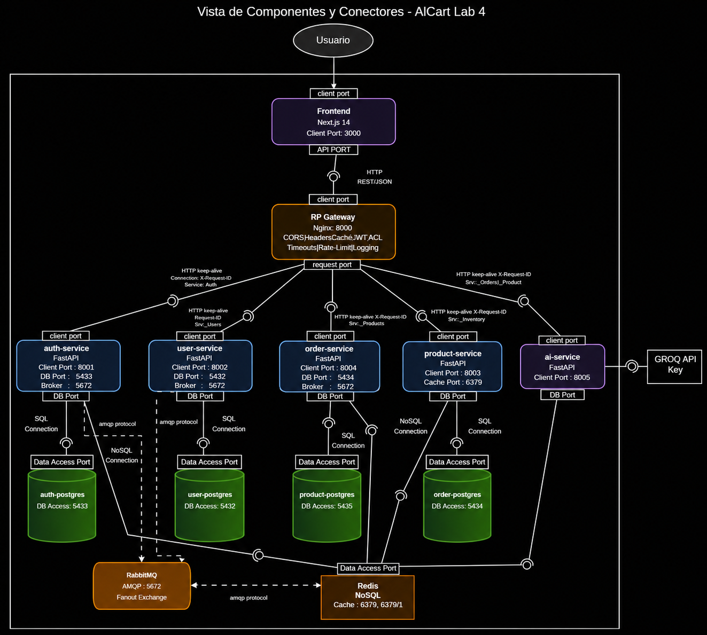

# Lab 4 — Reverse Proxy Pattern

**Curso:** Software Architecture 2025-II  
**Proyecto:** AICart — E-Commerce Microservices Platform

---

## Objetivo

Implementar el patrón **Reverse Proxy** como capa de indirección entre clientes externos y los microservicios internos, documentando la vista de Componentes & Conectores del sistema resultante.

---

## ¿Qué es el Reverse Proxy Pattern?

Un reverse proxy es un servidor intermediario que:

1. Recibe todas las peticiones externas en un único punto de entrada.
2. Las reenvía al servicio interno correspondiente según reglas de routing.
3. Retorna la respuesta al cliente original.

El cliente **nunca conoce** la dirección ni el puerto real de los servicios backend. Toda la topología interna queda oculta.

---

## Implementación en AICart

NGINX (`api-gateway/`) actúa como único reverse proxy del sistema. Es el **único contenedor con puertos expuestos al host**.

### Routing por prefijo de path

```nginx
# api-gateway/shared.conf
location /auth/ {
    proxy_pass http://auth_backend;
}

location /users/ {
    proxy_pass http://user-service:8000;
}

location /products/ {
    proxy_pass http://product-service:8003;
}

location /orders/ {
    rewrite ^/orders/(.*) /api/v1/orders/$1 break;
    proxy_pass http://order-service:8004;
}

location /ai/ {
    rewrite ^/ai/(.*) /api/v1/$1 break;
    proxy_pass http://ai-service:8005;
    proxy_read_timeout 60s;
}
```

Cada microservicio escucha en `subnet_b` (red privada Docker). No tienen puertos expuestos al host — solo son alcanzables a través del gateway.

### Headers de forwarding

```nginx
proxy_set_header Host              $host;
proxy_set_header X-Real-IP         $remote_addr;
proxy_set_header X-Forwarded-For   $proxy_add_x_forwarded_for;
proxy_set_header X-Forwarded-Proto $scheme;
```

Esto permite a cada servicio conocer la IP real del cliente y el protocolo original, aunque la conexión llegue internamente por HTTP.

### Centralización de CORS y headers de seguridad

```nginx
# api-gateway/shared.conf
add_header X-Content-Type-Options  "nosniff"                          always;
add_header X-Frame-Options         "DENY"                             always;
add_header Referrer-Policy         "strict-origin-when-cross-origin"  always;

add_header Access-Control-Allow-Origin  "$cors_origin"   always;
add_header Access-Control-Allow-Methods "GET, POST, PUT, DELETE, OPTIONS" always;
add_header Access-Control-Allow-Headers "Authorization, Content-Type"     always;
```

Al centralizar CORS en el gateway se usa `proxy_hide_header` para suprimir cualquier header CORS que los servicios pudieran enviar, evitando respuestas duplicadas.

### Upstream con failover (auth-service)

```nginx
upstream auth_backend {
    server ecommerce_auth_service:8001      max_fails=2 fail_timeout=5s;
    server ecommerce_auth_service_cold:8002 backup;
}
```

El proxy gestiona automáticamente el failover: si el servidor primario falla 2 veces en 5s, NGINX redirige al backup sin que el cliente lo perciba.

---

## Beneficios obtenidos

| Beneficio | Descripción |
|---|---|
| **Ocultamiento de topología** | Los clientes no conocen IPs, puertos ni existencia de los microservicios |
| **Punto único de CORS/seguridad** | Headers de seguridad gestionados en un solo lugar |
| **SSL Termination** | TLS se termina en NGINX; la red interna usa HTTP plano |
| **Load balancing / failover** | NGINX gestiona upstream primario y backup |
| **Rate limiting centralizado** | Zonas `general` (10 r/s) y `ai_zone` (2 r/s) definidas en un solo archivo |
| **Simplificación de clientes** | El frontend solo conoce la URL del gateway (`https://localhost:8443`) |

---

## Vista de Componentes & Conectores

El diagrama C&C documentado en este lab muestra los 5 microservicios, sus bases de datos individuales, RabbitMQ, Redis, y cómo NGINX actúa como punto de acceso único:



> El diagrama fue construido con base en la implementación real del `docker-compose.yml` y los archivos de configuración de NGINX.

---

## Archivos relevantes

| Archivo | Descripción |
|---|---|
| `api-gateway/nginx.conf` | Configuración principal: upstream auth, rate-limit zones, servers HTTP/HTTPS |
| `api-gateway/shared.conf` | Routing, CORS, headers de seguridad, location blocks por servicio |
| `docker-compose.yml` | Definición de redes y ausencia de port-mapping en backends |
| `docs/lab4/C&C.png` | Vista Component & Connector completa |
