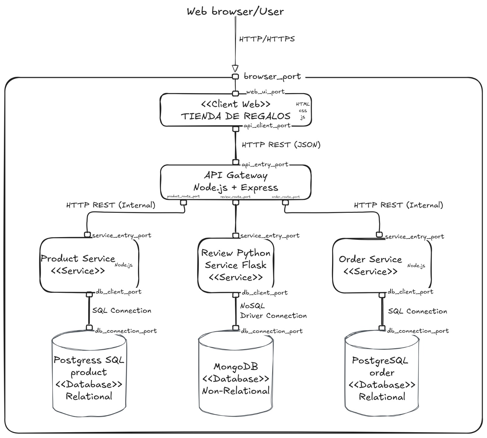

# 🎁 Boutique de Regalos Villapinzón

---

## 1. Team

**Group:** 3f

| # | Full Name |
|---|-----------|
| 1 | Laura Valentina Díaz Velandia |
| 2 | Juan Daniel Gonzales Sierra |
| 3 | Juan Sebastian Muñoz Lemus|
| 4 | Juan Felipe Hernández Ochoa |
| 5 | Juan David Montenegro Lopez  |

---

## 2. Software System

### Name
**Boutique de Regalos Villapinzón**

### Logo


### Description

Boutique de Regalos Villapinzón is a web-based e-commerce platform designed for a small gift shop located in Villapinzón, Colombia. The system allows customers to browse a product catalog, view product details, manage a shopping cart, place orders, and submit product reviews. It also includes an administrative panel for product management and sales monitoring.

The system is built following a **microservices architecture**, where each business domain is handled by an independent service with its own database, all coordinated through a central API Gateway.

---

## 3. Architectural Structures

### 3.1 Component-and-Connector (C&C) Structure

#### C&C View

The following diagram illustrates the runtime components of the system and their connectors:



#### Description of Architectural Styles Used

**Microservices Architecture**

The system adopts a microservices architectural style, in which the application is structured as a collection of small, independently deployable services. Each service encapsulates a specific business capability (products, orders, reviews) and communicates with others exclusively through well-defined HTTP/REST interfaces. This style promotes separation of concerns, independent scalability, and technology heterogeneity — as evidenced by the use of both Node.js and Python across the services.

**API Gateway Pattern**

An API Gateway is employed as the single entry point for all client requests. Rather than having the frontend communicate directly with each microservice, the Gateway centralizes routing, CORS management, and request delegation. This pattern simplifies the client interface and enables future cross-cutting concerns such as authentication and rate limiting to be implemented in a single place.

**Polyglot Persistence**

The system applies polyglot persistence, selecting the most appropriate database technology for each service's domain requirements. Structured, transactional data (products and orders) is stored in PostgreSQL, which provides ACID compliance and relational integrity. Unstructured, schema-flexible data (reviews) is stored in MongoDB, which offers document-oriented storage and faster write throughput.

#### Description of Architectural Elements and Relations

| Element | Type | Technology | Responsibility |
|---------|------|------------|----------------|
| Client Web (Frontend) | Client Component | HTML5, CSS3, JS, Tailwind CSS | User interface: catalog, cart, reviews, admin panel |
| API Gateway | Connector / Service | Node.js, Express.js | Central HTTP router; delegates requests to microservices |
| Product Service | Service | Node.js, Express.js | CRUD operations for products and stock management |
| Order Service | Service | Node.js, Express.js | Order creation and retrieval; order item management |
| Review Service | Service | Python, FastAPI, Uvicorn | Review creation, retrieval, and deletion per product |
| PostgreSQL (giftshop) | Data Store | PostgreSQL 15 | Persistent relational storage for product catalog |
| PostgreSQL (ordersdb) | Data Store | PostgreSQL 15 | Persistent relational storage for orders and order items |
| MongoDB (reviewsdb) | Data Store | MongoDB 6 | Document store for product reviews |

**Connectors:**

- **HTTP REST (JSON):** All inter-component communication uses synchronous HTTP REST over JSON. The frontend communicates with the API Gateway; the Gateway communicates with each microservice using the Axios HTTP client.
- **SQL Connection:** Product Service and Order Service connect to their respective PostgreSQL instances using the `pg` (node-postgres) driver.
- **NoSQL Driver Connection:** Review Service connects to MongoDB using the `pymongo` driver.

---

### 3.2 API Reference

| Route | Method | Service | Description |
|-------|--------|---------|-------------|
| `/api/products` | GET | Product Service | List all products |
| `/api/products` | POST | Product Service | Create a product |
| `/api/products/:id` | PUT | Product Service | Update product price |
| `/api/products/:id` | DELETE | Product Service | Delete a product |
| `/api/products/:id/stock` | PUT | Product Service | Decrement product stock |
| `/api/orders` | GET | Order Service | List all orders |
| `/api/orders` | POST | Order Service | Create an order |
| `/api/reviews/:product_id` | GET | Review Service | Get reviews for a product |
| `/api/reviews` | POST | Review Service | Submit a review |
| `/api/reviews/:id` | DELETE | Review Service | Delete a review |

---

## 4. Prototype

### Prerequisites

Ensure the following tools are installed on your machine before proceeding:

- [Docker](https://www.docker.com/get-started) (version 20 or later)
- [Docker Compose](https://docs.docker.com/compose/install/) (version 2 or later)
- [Git](https://git-scm.com/)

Verify the installations:

```bash
docker --version
docker compose version
git --version
```

---

### Instructions for Deploying the System Locally


**Step 1 — Build and start all containers**

```bash
docker-compose up --build
```

This command will download all required base images, build each service, and start the containers. The first execution may take several minutes. Once ready, the terminal should display output similar to the following:

```
product-service-1  | Conectado a PostgreSQL
product-service-1  | Tabla products lista
order-service-1    | Conectado a PostgreSQL (Orders)
order-service-1    | Tablas de orders listas
review-service-1   | Conectado a MongoDB
review-service-1   | Review Service en puerto 6000
api-gateway-1      | API Gateway en puerto 3000
```

**Step 2 — Access the application**

Once all services are running, open a browser and navigate to the following URLs:

| View | URL |
|------|-----|
| Main storefront | http://localhost:8080 |
| Product detail | http://localhost:8080/producto.html?id=1 |
| Shopping cart | http://localhost:8080/carrito.html |
| Admin panel | http://localhost:8080/admin.html |
| API Gateway (root) | http://localhost:3000 |

**Step 3 — Insert sample products (optional)**

To populate the database with test products, open the browser console (F12) on `http://localhost:8080` and execute:

```javascript
fetch("http://localhost:3000/api/products", {
  method: "POST",
  headers: { "Content-Type": "application/json" },
  body: JSON.stringify({
    nombre: "Sample Product",
    descripcion: "Product description",
    precio: 15000,
    stock: 10,
    imagen1: "",
    imagen2: "",
    imagen3: ""
  })
}).then(r => r.json()).then(console.log);
```

**Step 4 — Stop the system**

To stop all running containers:

```bash
docker-compose down
```

To stop and remove persistent volumes (databases):

```bash
docker-compose down --volumes
```

---

### Common Errors and Solutions

**`Chain 'DOCKER-ISOLATION-STAGE-2' does not exist`**

This error occurs when Docker's `iptables` rules are lost after a system restart.

```bash
sudo systemctl stop docker
sudo iptables -t filter -F
sudo iptables -t filter -X
sudo systemctl start docker
docker-compose down --remove-orphans
docker network prune -f
docker-compose up --build
```

If the error persists, a full system reboot typically resolves it:

```bash
sudo reboot
```

---

**`getaddrinfo ENOTFOUND` / DNS resolution failure**

Configure Google's DNS servers for Docker:

```bash
sudo nano /etc/docker/daemon.json
```

Add the following content:

```json
{
  "dns": ["8.8.8.8", "8.8.4.4"]
}
```

Save and restart Docker:

```bash
sudo systemctl restart docker
docker-compose up --build
```

---

**`permission denied` when running `docker-compose down`**

Run the command with elevated privileges:

```bash
sudo docker-compose down
```

---

**Containers are running but no products appear in the storefront**

Verify that all seven containers are active:

```bash
docker ps
```

The following containers must be listed: `frontend`, `api-gateway`, `product-service`, `order-service`, `review-service`, `products-postgres`, and `orders-postgres` (or `reviews-mongo`).

If any container is missing, inspect its logs:

```bash
docker-compose logs <service-name>
```

---

**`no such file or directory` during build**

Ensure the working directory is correct before running Docker Compose:

```bash
cd ArquiSoft_Tienda_de_Regalos/Tienda_de_Regalos
ls
# Expected output: api-gateway/  frontend/  order-service/  product-service/  review-service/  docker-compose.yml
```

---

### Production Deployment

The system is also deployed to the cloud and accessible at:

| Service | URL |
|---------|-----|
| Frontend | https://tienda-regalos-frontend.vercel.app |
| API Gateway | https://api-gateway-gilt-nu.vercel.app |

**Infrastructure:**
- Frontend, API Gateway, and all microservices are deployed on **Vercel** (serverless functions).
- PostgreSQL databases are hosted on **Supabase** (free tier).
- MongoDB is hosted on **MongoDB Atlas** (free tier).
